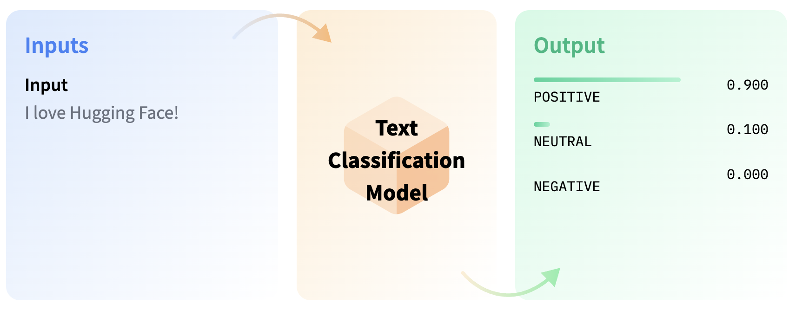
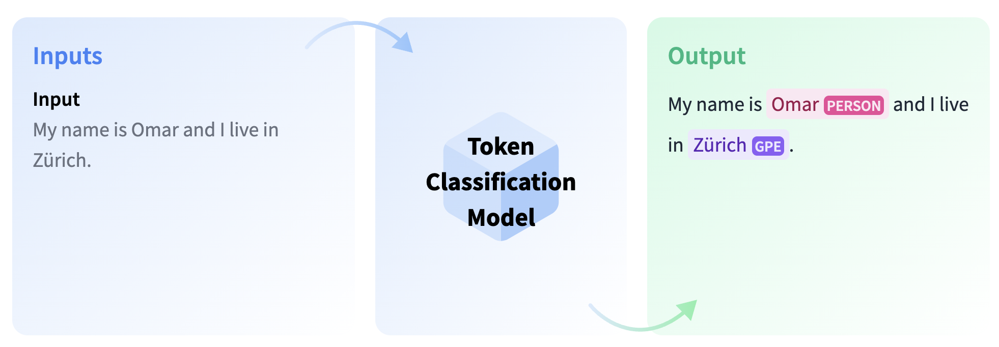
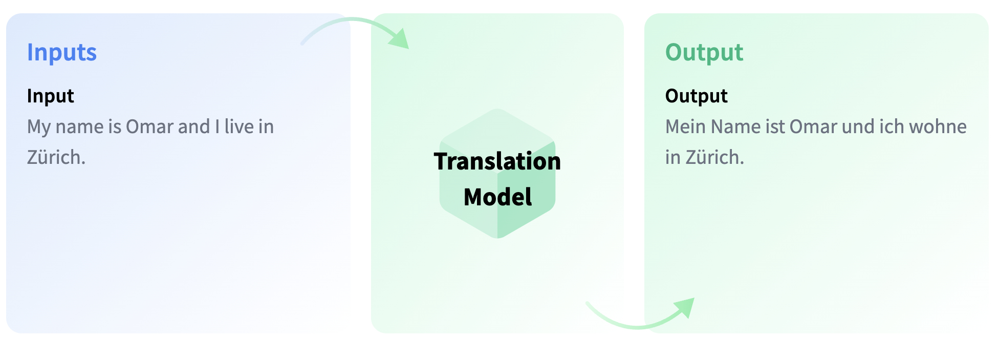
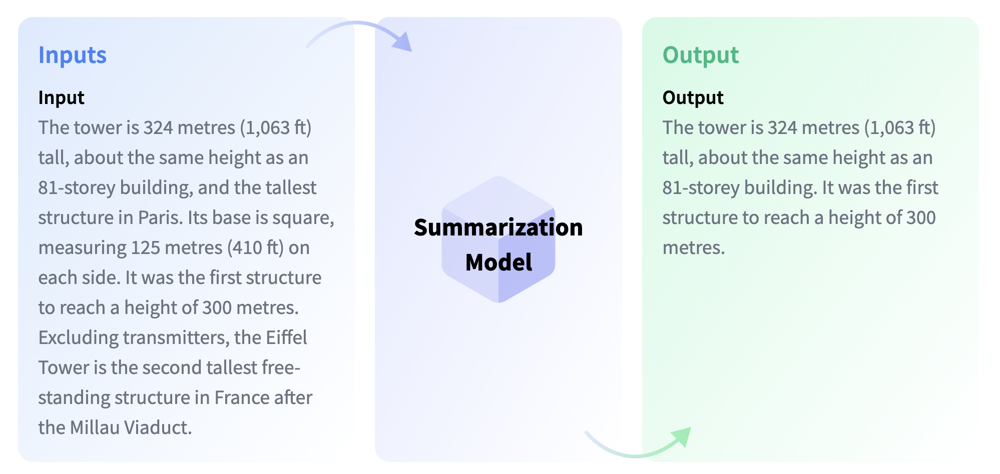
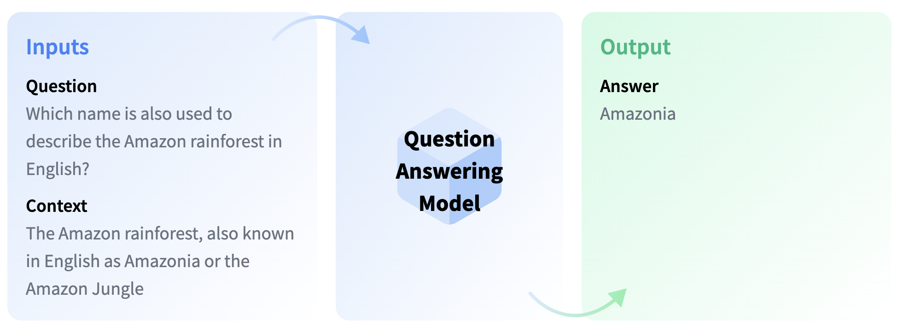
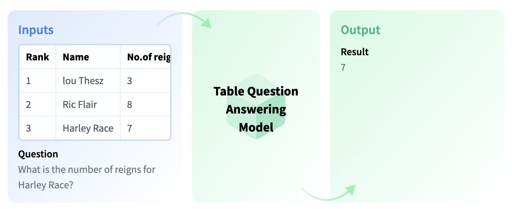

<p align="center">
  <a href="https://postgresml.org/">
    
  </a>
</p>
  
<h2 align="center">
  <a href="https://postgresml.org/">
    <svg version="1.1"
        xmlns="http://www.w3.org/2000/svg"
        xmlns:xlink="http://www.w3.org/1999/xlink"
        width="200" height="50"
    >
        <text font-size="32" x="20" y="32">
            <tspan fill="white" style="mix-blend-mode: difference;">Postgres</tspan><tspan fill="dodgerblue">ML</tspan>
        </text>
    </svg>
  </a>
</h2>

<p align="center">
    Generative AI with 
    <a href="https://www.postgresql.org/" target="_blank">PostgreSQL</a>
</p>

<p align="center">
    
    <a href="https://discord.gg/DmyJP3qJ7U" target="_blank">
        
    </a>
</p>


# Table of contents
- [Introduction](#introduction)
- [Installation](#installation)
- [Getting started](#getting-started)
- [Natural Language Processing](#nlp-tasks)
    - [Text Classification](#text-classification)
    - [Zero-Shot Classification](#zero-shot-classification)
    - [Token Classification](#token-classification)
    - [Translation](#translation)
    - [Summarization](#summarization)
    - [Question Answering](#question-answering)
    - [Table Question Answering](#table-question-answering)
    - [Text Generation](#text-generation)
    - [Fill-Mask](#fill-mask)
    - [Sentence Similarity](#sentence-similarity)
- [Regression](#regression)
- [Classification](#classification)

# Introduction
PostgresML is a PostgreSQL extension that enables you to perform ML training and inference on text and tabular data using SQL queries. With PostgresML, you can seamlessly integrate machine learning models into your PostgreSQL database and harness the power of cutting-edge algorithms to process text and tabular data efficiently.

## Text Data
- Perform natural language processing (NLP) tasks like sentiment analysis, question and answering, translation, summarization and text generation
- Access 1000s of state-of-the-art language models like GPT-2, GPT-J, GPT-Neo from :hugs: HuggingFace model hub
- Fine tune large language models (LLMs) on your own text data for different tasks

**Translation**

*SQL query*

```sql
SELECT pgml.transform(
    'translation_en_to_fr',
    inputs => ARRAY[
        'Welcome to the future!',
        'Where have you been all this time?'
    ]
) AS french;
```
*Result*

```sql
                         french                                 
------------------------------------------------------------

[
    {"translation_text": "Bienvenue à l'avenir!"},
    {"translation_text": "Où êtes-vous allé tout ce temps?"}
]
```


**Sentiment Analysis**
*SQL query*

```sql
SELECT pgml.transform(
    task   => 'text-classification',
    inputs => ARRAY[
        'I love how amazingly simple ML has become!', 
        'I hate doing mundane and thankless tasks. ☹️'
    ]
) AS positivity;
```
*Result*
```sql
                    positivity
------------------------------------------------------
[
    {"label": "POSITIVE", "score": 0.9995759129524232}, 
    {"label": "NEGATIVE", "score": 0.9903519749641418}
]
```

## Tabular data
- [47+ classification and regression algorithms](https://postgresml.org/docs/guides/training/algorithm_selection)
- [8 - 40X faster inference than HTTP based model serving](https://postgresml.org/blog/postgresml-is-8x-faster-than-python-http-microservices)
- [Millions of transactions per second](https://postgresml.org/blog/scaling-postgresml-to-one-million-requests-per-second)
- [Horizontal scalability](https://github.com/postgresml/pgcat)


**Training a classification model**

*Training*
```sql
SELECT * FROM pgml.train(
    'Handwritten Digit Image Classifier',
    algorithm => 'xgboost',
    'classification',
    'pgml.digits',
    'target'
);
```

*Inference*
```sql
SELECT pgml.predict(
    'My Classification Project', 
    ARRAY[0.1, 2.0, 5.0]
) AS prediction;
```

# Installation
PostgresML installation consists of three parts: PostgreSQL database, Postgres extension for machine learning and a dashboard app. The extension provides all the machine learning functionality and can be used independently using any SQL IDE. The dashboard app provides a eays to use interface for writing SQL notebooks, performing and tracking ML experiments and ML models.

## Docker

Step 1: Clone this repository

```bash
git clone git@github.com:postgresml/postgresml.git
```

Step 2: Start dockerized services. PostgresML will run on port 5433, just in case you already have Postgres running. You can find Docker installation instructions [here](https://docs.docker.com/desktop/)
```bash
cd postgresml
docker-compose up
```

Step 3: Connect to PostgresDB with PostgresML enabled using a SQL IDE or <a href="https://www.postgresql.org/docs/current/app-psql.html" target="_blank">psql</a>
```bash
postgres://postgres@localhost:5433/pgml_development
```

## Free trial
If you want to check out the functionality without the hassle of Docker please go ahead and start PostgresML by signing up for a free account [here](https://postgresml.org/signup). We will provide 5GiB disk space on a shared tenant.

# Getting Started

## Option 1
- On local installation go to dashboard app at `http://localhost:8000/` to use SQL notebooks.

- On the free tier click on **Dashboard** button to use SQL notebooks.


- Try one of the pre-built SQL notebooks


## Option 2
- Use any of these popular tools to connect to PostgresML and write SQL queries
  - <a href="https://superset.apache.org/" target="_blank">Apache Superset</a>
  - <a href="https://dbeaver.io/" target="_blank">DBeaver</a>
  - <a href="https://www.jetbrains.com/datagrip/" target="_blank">Data Grip</a>
  - <a href="https://eggerapps.at/postico2/" target="_blank">Postico 2</a>
  - <a href="https://popsql.com/" target="_blank">Popsql</a>
  - <a href="https://www.tableau.com/" target="_blank">Tableau</a>
  - <a href="https://powerbi.microsoft.com/en-us/" target="_blank">PowerBI</a>
  - <a href="https://jupyter.org/" target="_blank">Jupyter</a>
  - <a href="https://code.visualstudio.com/" target="_blank">VSCode</a>

# NLP Tasks
PostgresML integrates 🤗 Hugging Face Transformers to bring state-of-the-art NLP models into the data layer. There are tens of thousands of pre-trained models with pipelines to turn raw text in your database into useful results. Many state of the art deep learning architectures have been published and made available from Hugging Face <a href= "https://huggingface.co/models" target="_blank">model hub</a>.

You can call different NLP tasks and customize using them using the following SQL query.

```sql
SELECT pgml.transform(
    task   => TEXT OR JSONB,     -- Pipeline initializer arguments
    inputs => TEXT[] OR BYTEA[], -- inputs for inference
    args   => JSONB              -- (optional) arguments to the pipeline.
)
```
## Text Classification

Text classification involves assigning a label or category to a given text. Common use cases include sentiment analysis, natural language inference, and the assessment of grammatical correctness.



### Sentiment Analysis
Sentiment analysis is a type of natural language processing technique that involves analyzing a piece of text to determine the sentiment or emotion expressed within it. It can be used to classify a text as positive, negative, or neutral, and has a wide range of applications in fields such as marketing, customer service, and political analysis.

*Basic usage*
```sql
SELECT pgml.transform(
    task   => 'text-classification',
    inputs => ARRAY[
        'I love how amazingly simple ML has become!', 
        'I hate doing mundane and thankless tasks. ☹️'
    ]
) AS positivity;
```
*Result*
```json
[
    {"label": "POSITIVE", "score": 0.9995759129524232}, 
    {"label": "NEGATIVE", "score": 0.9903519749641418}
]
```
The default <a href="https://huggingface.co/distilbert-base-uncased-finetuned-sst-2-english" target="_blank">model</a> used for text classification is a fine-tuned version of DistilBERT-base-uncased that has been specifically optimized for the Stanford Sentiment Treebank dataset (sst2).


*Using specific model*

To use one of the over 19,000 models available on Hugging Face, include the name of the desired model and `text-classification` task as a JSONB object in the SQL query. For example, if you want to use a RoBERTa <a href="https://huggingface.co/models?pipeline_tag=text-classification" target="_blank">model</a> trained on around 40,000 English tweets and that has POS (positive), NEG (negative), and NEU (neutral) labels for its classes, include this information in the JSONB object when making your query.

```sql
SELECT pgml.transform(
    inputs => ARRAY[
        'I love how amazingly simple ML has become!', 
        'I hate doing mundane and thankless tasks. ☹️'
    ],
    task  => '{"task": "text-classification", 
              "model": "finiteautomata/bertweet-base-sentiment-analysis"
             }'::JSONB
) AS positivity;
```
*Result*
```json
[
    {"label": "POS", "score": 0.992932200431826}, 
    {"label": "NEG", "score": 0.975599765777588}
]
```

*Using industry specific model*

By selecting a model that has been specifically designed for a particular industry, you can achieve more accurate and relevant text classification. An example of such a model is <a href="https://huggingface.co/ProsusAI/finbert" target="_blank">FinBERT</a>, a pre-trained NLP model that has been optimized for analyzing sentiment in financial text. FinBERT was created by training the BERT language model on a large financial corpus, and fine-tuning it to specifically classify financial sentiment. When using FinBERT, the model will provide softmax outputs for three different labels: positive, negative, or neutral.

```sql
SELECT pgml.transform(
    inputs => ARRAY[
        'Stocks rallied and the British pound gained.', 
        'Stocks making the biggest moves midday: Nvidia, Palantir and more'
    ],
    task => '{"task": "text-classification", 
              "model": "ProsusAI/finbert"
             }'::JSONB
) AS market_sentiment;
```

*Result*
```json
[
    {"label": "positive", "score": 0.8983612656593323}, 
    {"label": "neutral", "score": 0.8062630891799927}
]
```

### Natural Language Inference (NLI)
NLI, or Natural Language Inference, is a type of model that determines the relationship between two texts. The model takes a premise and a hypothesis as inputs and returns a class, which can be one of three types:
- Entailment: This means that the hypothesis is true based on the premise.
- Contradiction: This means that the hypothesis is false based on the premise.
- Neutral: This means that there is no relationship between the hypothesis and the premise.

The GLUE dataset is the benchmark dataset for evaluating NLI models. There are different variants of NLI models, such as Multi-Genre NLI, Question NLI, and Winograd NLI.

If you want to use an NLI model, you can find them on the :hugs: Hugging Face model hub. Look for models with "mnli".

```sql
SELECT pgml.transform(
    inputs => ARRAY[
        'A soccer game with multiple males playing. Some men are playing a sport.'
    ],
    task => '{"task": "text-classification", 
              "model": "roberta-large-mnli"
             }'::JSONB
) AS nli;
```
*Result*
```json
[
    {"label": "ENTAILMENT", "score": 0.98837411403656}
]
```
### Question Natural Language Inference (QNLI)
The QNLI task involves determining whether a given question can be answered by the information in a provided document. If the answer can be found in the document, the label assigned is "entailment". Conversely, if the answer cannot be found in the document, the label assigned is "not entailment".

If you want to use an QNLI model, you can find them on the :hugs: Hugging Face model hub. Look for models with "qnli".

```sql
SELECT pgml.transform(
    inputs => ARRAY[
        'Where is the capital of France?, Paris is the capital of France.'
    ],
    task => '{"task": "text-classification", 
              "model": "cross-encoder/qnli-electra-base"
             }'::JSONB
) AS qnli;
```

*Result*
```json
[
    {"label": "LABEL_0", "score": 0.9978110194206238}
]
```

### Quora Question Pairs (QQP)
The Quora Question Pairs model is designed to evaluate whether two given questions are paraphrases of each other. This model takes the two questions and assigns a binary value as output. LABEL_0 indicates that the questions are paraphrases of each other and LABEL_1 indicates that the questions are not paraphrases. The benchmark dataset used for this task is the Quora Question Pairs dataset within the GLUE benchmark, which contains a collection of question pairs and their corresponding labels.

If you want to use an QQP model, you can find them on the :hugs: Hugging Face model hub. Look for models with `qqp`.

```sql
SELECT pgml.transform(
    inputs => ARRAY[
        'Which city is the capital of France?, Where is the capital of France?'
    ],
    task => '{"task": "text-classification", 
              "model": "textattack/bert-base-uncased-QQP"
             }'::JSONB
) AS qqp;
```

*Result*
```json
[
    {"label": "LABEL_0", "score": 0.9988721013069152}
]
```

### Grammatical Correctness
Linguistic Acceptability is a task that involves evaluating the grammatical correctness of a sentence. The model used for this task assigns one of two classes to the sentence, either "acceptable" or "unacceptable". LABEL_0 indicates acceptable and LABEL_1 indicates unacceptable. The benchmark dataset used for training and evaluating models for this task is the Corpus of Linguistic Acceptability (CoLA), which consists of a collection of texts along with their corresponding labels. 

If you want to use a grammatical correctness model, you can find them on the :hugs: Hugging Face model hub. Look for models with `cola`.

```sql
SELECT pgml.transform(
    inputs => ARRAY[
        'I will walk to home when I went through the bus.'
    ],
    task => '{"task": "text-classification", 
              "model": "textattack/distilbert-base-uncased-CoLA"
             }'::JSONB
) AS grammatical_correctness;
```
*Result*
```json
[
    {"label": "LABEL_1", "score": 0.9576480388641356}
]
```

## Zero-Shot Classification
Zero Shot Classification is a task where the model predicts a class that it hasn't seen during the training phase. This task leverages a pre-trained language model and is a type of transfer learning. Transfer learning involves using a model that was initially trained for one task in a different application. Zero Shot Classification is especially helpful when there is a scarcity of labeled data available for the specific task at hand.


In the example provided below, we will demonstrate how to classify a given sentence into a class that the model has not encountered before. To achieve this, we make use of `args` in the SQL query, which allows us to provide `candidate_labels`. You can customize these labels to suit the context of your task. We will use `facebook/bart-large-mnli` model.

Look for models with `mnli` to use a zero-shot classification model on the :hugs: Hugging Face model hub.

```sql
SELECT pgml.transform(
    inputs => ARRAY[
        'I have a problem with my iphone that needs to be resolved asap!!'
    ],
    task => '{
                "task": "zero-shot-classification", 
                "model": "facebook/bart-large-mnli"
             }'::JSONB,
    args => '{
                "candidate_labels": ["urgent", "not urgent", "phone", "tablet", "computer"]
             }'::JSONB
) AS zero_shot;
```
*Result*

```json
[
    {
        "labels": ["urgent", "phone", "computer", "not urgent", "tablet"], 
        "scores": [0.503635, 0.47879, 0.012600, 0.002655, 0.002308], 
        "sequence": "I have a problem with my iphone that needs to be resolved asap!!"
    }
]
```
## Token Classification
Token classification is a task in natural language understanding, where labels are assigned to certain tokens in a text. Some popular subtasks of token classification include Named Entity Recognition (NER) and Part-of-Speech (PoS) tagging. NER models can be trained to identify specific entities in a text, such as individuals, places, and dates. PoS tagging, on the other hand, is used to identify the different parts of speech in a text, such as nouns, verbs, and punctuation marks.



### Named Entity Recognition
Named Entity Recognition (NER) is a task that involves identifying named entities in a text. These entities can include the names of people, locations, or organizations. The task is completed by labeling each token with a class for each named entity and a class named "0" for tokens that don't contain any entities. In this task, the input is text, and the output is the annotated text with named entities.

```sql
SELECT pgml.transform(
    inputs => ARRAY[
        'I am Omar and I live in New York City.'
    ],
    task => 'token-classification'
) as ner;
```
*Result*
```json
[[
    {"end": 9,  "word": "Omar", "index": 3,  "score": 0.997110, "start": 5,  "entity": "I-PER"}, 
    {"end": 27, "word": "New",  "index": 8,  "score": 0.999372, "start": 24, "entity": "I-LOC"}, 
    {"end": 32, "word": "York", "index": 9,  "score": 0.999355, "start": 28, "entity": "I-LOC"}, 
    {"end": 37, "word": "City", "index": 10, "score": 0.999431, "start": 33, "entity": "I-LOC"}
]]
```

### Part-of-Speech (PoS) Tagging
PoS tagging is a task that involves identifying the parts of speech, such as nouns, pronouns, adjectives, or verbs, in a given text. In this task, the model labels each word with a specific part of speech.

Look for models with `pos` to use a zero-shot classification model on the :hugs: Hugging Face model hub.
```sql
select pgml.transform(
	inputs => array [
  	'I live in Amsterdam.'
	],
	task => '{"task": "token-classification", 
              "model": "vblagoje/bert-english-uncased-finetuned-pos"
    }'::JSONB
) as pos;
```
*Result*
```json
[[
    {"end": 1,  "word": "i",         "index": 1, "score": 0.999, "start": 0,  "entity": "PRON"},
    {"end": 6,  "word": "live",      "index": 2, "score": 0.998, "start": 2,  "entity": "VERB"},
    {"end": 9,  "word": "in",        "index": 3, "score": 0.999, "start": 7,  "entity": "ADP"},
    {"end": 19, "word": "amsterdam", "index": 4, "score": 0.998, "start": 10, "entity": "PROPN"}, 
    {"end": 20, "word": ".",         "index": 5, "score": 0.999, "start": 19, "entity": "PUNCT"}
]]
```
## Translation
Translation is the task of converting text written in one language into another language.



You have the option to select from over 2000 models available on the Hugging Face <a href="https://huggingface.co/models?pipeline_tag=translation" target="_blank">hub</a> for translation.

```sql
select pgml.transform(
    inputs => array[
            	'How are you?'
    ],
	task => '{"task": "translation", 
              "model": "Helsinki-NLP/opus-mt-en-fr"
    }'::JSONB	
);
```
*Result*
```json
[
    {"translation_text": "Comment allez-vous ?"}
]
```
## Summarization
Summarization involves creating a condensed version of a document that includes the important information while reducing its length. Different models can be used for this task, with some models extracting the most relevant text from the original document, while other models generate completely new text that captures the essence of the original content.



```sql
select pgml.transform(
	task => '{"task": "summarization", 
              "model": "sshleifer/distilbart-cnn-12-6"
    }'::JSONB,
	inputs => array[
	'Paris is the capital and most populous city of France, with an estimated population of 2,175,601 residents as of 2018, in an area of more than 105 square kilometres (41 square miles). The City of Paris is the centre and seat of government of the region and province of Île-de-France, or Paris Region, which has an estimated population of 12,174,880, or about 18 percent of the population of France as of 2017.'
	]
);
```
*Result*
```json
[
    {"summary_text": " Paris is the capital and most populous city of France, with an estimated population of 2,175,601 residents as of 2018 . The city is the centre and seat of government of the region and province of Île-de-France, or Paris Region . Paris Region has an estimated 18 percent of the population of France as of 2017 ."}
    ]
```
You can control the length of summary_text by passing `min_length` and `max_length` as arguments to the SQL query.

```sql
select pgml.transform(
	task => '{"task": "summarization", 
              "model": "sshleifer/distilbart-cnn-12-6"
    }'::JSONB,
	inputs => array[
	'Paris is the capital and most populous city of France, with an estimated population of 2,175,601 residents as of 2018, in an area of more than 105 square kilometres (41 square miles). The City of Paris is the centre and seat of government of the region and province of Île-de-France, or Paris Region, which has an estimated population of 12,174,880, or about 18 percent of the population of France as of 2017.'
	],
	args => '{
            "min_length" : 20,
            "max_length" : 70
	}'::JSONB
);
```

```json
[
    {"summary_text": " Paris is the capital and most populous city of France, with an estimated population of 2,175,601 residents as of 2018 . City of Paris is centre and seat of government of the region and province of Île-de-France, or Paris Region, which has an estimated 12,174,880, or about 18 percent"
    }  
]
```
## Question Answering
Question Answering models are designed to retrieve the answer to a question from a given text, which can be particularly useful for searching for information within a document. It's worth noting that some question answering models are capable of generating answers even without any contextual information.



```sql
SELECT pgml.transform(
    'question-answering',
    inputs => ARRAY[
        '{
            "question": "Where do I live?",
            "context": "My name is Merve and I live in İstanbul."
        }'
    ]
) AS answer;
```
*Result*

```json
{
    "end"   :  39, 
    "score" :  0.9538117051124572, 
    "start" :  31, 
    "answer": "İstanbul"
}
```
<!-- ## Table Question Answering
 -->

## Text Generation
Text generation is the task of producing new text, such as filling in incomplete sentences or paraphrasing existing text. It has various use cases, including code generation and story generation. Completion generation models can predict the next word in a text sequence, while text-to-text generation models are trained to learn the mapping between pairs of texts, such as translating between languages. Popular models for text generation include GPT-based models, T5, T0, and BART. These models can be trained to accomplish a wide range of tasks, including text classification, summarization, and translation.


```sql
SELECT pgml.transform(
    task => 'text-generation',
    inputs => ARRAY[
        'Three Rings for the Elven-kings under the sky, Seven for the Dwarf-lords in their halls of stone'
    ]
) AS answer;
```
*Result*

```json
[
    [
        {"generated_text": "Three Rings for the Elven-kings under the sky, Seven for the Dwarf-lords in their halls of stone, and eight for the Dragon-lords in their halls of blood.\n\nEach of the guild-building systems is one-man"}
    ]
]
```
### Text2Text Generation
## Fill-Mask


## Sentence Similarity


<!-- ## Conversational -->
# Regression
# Classification


