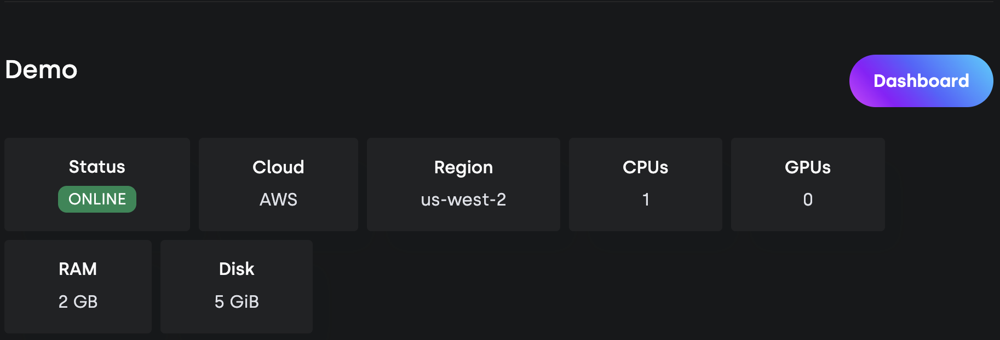
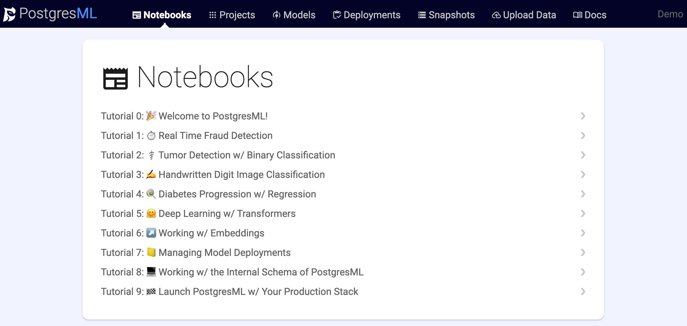

<p align="center">
  <a href="https://postgresml.org/">
    
  </a>
</p>
  
<h2 align="center">
  <a href="https://postgresml.org/">
    <svg version="1.1"
        xmlns="http://www.w3.org/2000/svg"
        xmlns:xlink="http://www.w3.org/1999/xlink"
        width="200" height="50"
    >
        <text font-size="32" x="20" y="32">
            <tspan fill="white" style="mix-blend-mode: difference;">Postgres</tspan><tspan fill="dodgerblue">ML</tspan>
        </text>
    </svg>
  </a>
</h2>

<p align="center">
    Simple machine learning with 
    <a href="https://www.postgresql.org/" target="_blank">PostgreSQL</a>
</p>

<p align="center">
    
    <a href="https://discord.gg/DmyJP3qJ7U" target="_blank">
        
    </a>
</p>


## Table of contents
- [Introduction](#introduction)
- [Installation](#installation)
- [Getting started](#getting-started)
- [Natural Language Processing](#nlp-tasks)
- [Regression](#regression)
- [Classification](#classification)

## Introduction
PostgresML is a PostgreSQL extension that enables you to perform ML training and inference on text and tabular data using SQL queries. With PostgresML, you can seamlessly integrate machine learning models into your PostgreSQL database and harness the power of cutting-edge algorithms to process text and tabular data efficiently.

### Text Data
- Perform natural language processing (NLP) tasks like sentiment analysis, question and answering, translation, summarization and text generation
- Access 1000s of state-of-the-art language models like GPT-2, GPT-J, GPT-Neo from :hugs: HuggingFace model hub
- Fine tune large language models (LLMs) on your own text data for different tasks

**Translation**
<table>
<tr>
<td>SQL Query</td>
<td>Result </td>
</tr>
<tr>
<td>

```sql
SELECT pgml.transform(
    'translation_en_to_fr',
    inputs => ARRAY[
        'Welcome to the future!',
        'Where have you been all this time?'
    ]
) AS french;
```
</td>
<td>

```sql
                         french                                 
------------------------------------------------------------

[
    {"translation_text": "Bienvenue à l'avenir!"},
    {"translation_text": "Où êtes-vous allé tout ce temps?"}
]
```
</td>
</tr>
</table>


**Sentiment Analysis**
<table>
<tr>
<td>SQL Query</td>
<td>Result </td>
</tr>
<tr>
<td>

```sql
SELECT pgml.transform(

    '{"model": "roberta-large-mnli"}'::JSONB,
    inputs => ARRAY
    [
        'I love how amazingly simple ML has become!', 
        'I hate doing mundane and thankless tasks. ☹️'
    ]

) AS positivity;
```
</td>
<td>

```sql
                    positivity
------------------------------------------------------
[
    {"label": "NEUTRAL", "score": 0.8143417835235596}, 
    {"label": "NEUTRAL", "score": 0.7637073993682861}
]
```
</td>
</tr>
</table>


### Tabular data
- [47+ classification and regression algorithms](https://postgresml.org/docs/guides/training/algorithm_selection)
- [8 - 40X faster inference than HTTP based model serving](https://postgresml.org/blog/postgresml-is-8x-faster-than-python-http-microservices)
- [Millions of transactions per second](https://postgresml.org/blog/scaling-postgresml-to-one-million-requests-per-second)
- [Horizontal scalability](https://github.com/postgresml/pgcat)


**Training a classification model**

<table>
<tr>
<td> Training </td>
<td> Inference </td>
</tr>
<tr>
<td>


```sql
SELECT * FROM pgml.train(
    'Handwritten Digit Image Classifier',
    algorithm => 'xgboost',
    'classification',
    'pgml.digits',
    'target'
);
```

</td>
<td>

```sql
SELECT pgml.predict(
    'My Classification Project', 
    ARRAY[0.1, 2.0, 5.0]
) AS prediction;
```
</td>
</tr>
</table>

## Installation
PostgresML installation consists of three parts: PostgreSQL database, Postgres extension for machine learning and a dashboard app. The extension provides all the machine learning functionality and can be used independently using any SQL IDE. The dashboard app provides a eays to use interface for writing SQL notebooks, performing and tracking ML experiments and ML models.

### Docker

Step 1: Clone this repository

```bash
git clone git@github.com:postgresml/postgresml.git
```

Step 2: Start dockerized services. PostgresML will run on port 5433, just in case you already have Postgres running. You can find Docker installation instructions [here](https://docs.docker.com/desktop/)
```bash
cd postgresml
docker-compose up
```

Step 3: Connect to PostgresDB with PostgresML enabled using a SQL IDE or [`psql`](https://www.postgresql.org/docs/current/app-psql.html)
```bash
postgres://postgres@localhost:5433/pgml_development
```

### Free trial
If you want to check out the functionality without the hassle of Docker please go ahead and start PostgresML by signing up for a free account [here](https://postgresml.org/signup). We will provide 5GiB disk space on a shared tenant.

## Getting Started

### Option 1
- On local installation go to dashboard app at `http://localhost:8000/` to use SQL notebooks.
- On the free tier click on **Dashboard** button to use SQL notebooks.

- Try one of the pre-built SQL notebooks


### Option 2
- Use any of these popular tools to connect to PostgresML and write SQL queries
  - [Apache Superset](https://superset.apache.org/)
  - [DBeaver](https://dbeaver.io/)
  - [Data Grip](https://www.jetbrains.com/datagrip/)
  - [Postico 2](https://eggerapps.at/postico2/)
  - [Popsql](https://popsql.com/)
  - [Tableau](https://www.tableau.com/)
  - [Power BI](https://powerbi.microsoft.com/en-us/)
  - [Jupyter](https://jupyter.org/)
  - [VSCode](https://code.visualstudio.com/)

## NLP Tasks
- Text Classification
- Token Classification
- Table Question Answering
- Question Answering
- Zero-Shot Classification
- Translation
- Summarization
- nConversational
- Text Generation
- Text2Text Generation
- Fill-Mask
- Sentence Similarity

## Regression
## Classification

## Applications
### Text
- AI writing partner 
- Chatbot for customer support
- Social media post analysis
- Fintech
- Healthcare
- Insurance


### Tabular data
- Fraud detection
- Recommendation


## Benefits
- Access to hugging face models - a little more about open source language models 
- Ease of fine tuning and why
- Rust based extension and its benefits
- Problems with HTTP serving and how PML enables microsecond latency 
- Pgcat for horizontal scaling

## Concepts
- Database
- Extension
- ML on text data
- Transform operation
- Fine tune operation
- ML on tabular data
- Train operation
- Deploy operation
- Predict operation

## Deployment
- Docker images
  - CPU
  - GPU
- Data persistence on local/EC2/EKS
- Deployment on AWS using docker images

## What's in the box
See the documentation for a complete **[list of functionality](https://postgresml.org/)**.

### All your favorite algorithms
Whether you need a simple linear regression, or extreme gradient boosting, we've included support for all classification and regression algorithms in [Scikit Learn](https://scikit-learn.org/) and [XGBoost](https://xgboost.readthedocs.io/) with no extra configuration.

### Managed model deployments
Models can be periodically retrained and automatically promoted to production depending on their key metric. Rollback capability is provided to ensure that you're always able to serve the highest quality predictions, along with historical logs of all deployments for long term study.

### Online and offline support
Predictions are served via a standard Postgres connection to ensure that your core apps can always access both your data and your models in real time. Pure SQL workflows also enable batch predictions to cache results in native Postgres tables for lookup.

### Instant visualizations
Run standard analysis on your datasets to detect outliers, bimodal distributions, feature correlation, and other common data visualizations on your datasets. Everything is cataloged in the dashboard for easy reference.

### Hyperparameter search
Use either grid or random searches with cross validation on your training set to discover the most important knobs to tweak on your favorite algorithm.

### SQL native vector operations
Vector operations make working with learned embeddings a snap, for things like nearest neighbor searches or other similarity comparisons.

### The performance of Postgres
Since your data never leaves the database, you retain the speed, reliability and security you expect in your foundational stateful services. Leverage your existing infrastructure and expertise to deliver new capabilities.

### Open source
We're building on the shoulders of giants. These machine learning libraries and Postgres have received extensive academic and industry use, and we'll continue their tradition to build with the community. Licensed under MIT.

## Frequently Asked Questions (FAQs)


