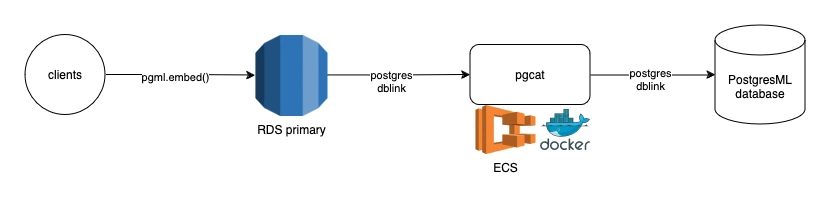

# pgml-rds-proxy

A pgcat-based PostgreSQL proxy that allows to use PostgresML functions on managed PostgreSQL databases that may not have Internet access, like AWS RDS.

<p align="center">
  
</p>

## Getting started

A Docker image is provided and is the easiest way to get started. To run the image, you can simply:

```bash
docker run \
    -e DATABASE_URL=postgres://pg:ml@sql.cloud.postgresml.org:38042/pgml \
    -p 6432:6432 \
    ghcr.io/postgresml/pgml-rds-proxy:latest
```

**Note:** Replace the `DATABASE_URL` above with the `DATABASE_URL` of your own PostgresML database.

If you're running this on EC2, make sure the instance is placed inside the same VPC as your RDS database and that the RDS database is allowed to make outbound connections to the EC2 instance.
The example above starts the proxy process on port 6432, so for your security group configuration, make sure the database can make outbound connections to the EC2 instance using TCP on port 6432.

### Configure FDW

We'll be using the Foreign Data Wrapper extension to connect from your RDS database to PostgresML, forwarding the connection through the proxy. If you're running the proxy on EC2, take note of the private IP
or DNS entry of the instance.

Before proceeding, make sure you have the following extensions installed into your RDS database:

```postgresql
CREATE EXTENSION IF NOT EXISTS dblink;
CREATE EXTENSION IF NOT EXISTS postgres_fdw;
```

Both of these require superuser, so make sure you're running these commands with a user that has the `rds_superuser` role.

To create a foreign data wrapper connection, take your PostgresML host and port and replace the host with the private IP or DNS entry of the instance.

```postgresql
CREATE SERVER postgresml
FOREIGN DATA WRAPPER postgres_fdw
OPTIONS (
    host '127.0.0.1',
    port '6432',
    dbname 'pgml'
);
```

Replace the value for `host`  with the private IP or DNS entry of the EC2 instance running the proxy. Replace the `dbname` with the name of the database from your PostgresML database `DATABASE_URL`.

#### User mapping

PostgresML and the proxy requires authentication. For each user that will use the connection, create a user mapping, like so:

```postgresql
CREATE USER MAPPING
FOR CURRENT_USER
SERVER postgresml
OPTIONS (
    user 'pg',
    password 'ml'
);
```

Replace the values for `user` and `password` with the values from your PostgresML database `DATABASE_URL`. This example contains values that will only work with our demo server and aren't suitable for production. `CURRENT_USER` is a special PostgreSQL variable that's replaced by the name of the user running the command. If you want to create this mapping for other users, replace it with the name of the user/role.

### Test the connection

To test the connection, you can use `dblink`:

```
SELECT
    *
FROM
    dblink(
        'postgresml',
        'SELECT * FROM pgml.embed(''Alibaba-NLP/gte-base-en-v1.5'', ''embed this text'') AS embedding'
) AS t1(embedding real[386]);
```

If everything is configured correctly, you should see an array of 386 floating points, your first embedding generated using PostgresML on AWS RDS. Both dblink and the proxy makes efficient use of connections, so queries will be executed as fast as the network connection allows.
