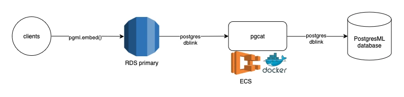

# Adding PostgresML to AWS RDS

<div align="left">

<figure><figcaption></figcaption></figure>

</div>

Lev Kokotov

April 23, 2024

## Introduction

PostgresML is a Postgres extension that allows to do machine learning inside your database. It gives access to 50+ regression and classification algorithms like XGBoost & LightGBM, and integrates with Hugging Face transformers to generate in-database embeddings, and much more.

PostgresML is open source and has its own managed cloud offering. Other managed cloud providers like AWS RDS don't currently offer the PostgresML extension, nor access to GPUs. Today, we're proud to announce a new path to adding PostgresML to AWS RDS (and other similar) databases.

## PostgresML RDS Proxy

PostgresML RDS Proxy is an application that can be launched into any cloud provider, e.g. EC2, and provide network-based access to PostgresML from any database running on a managed service, like AWS RDS.

With the help of two additional Postgres extensions, `dblink` and `postgres_fdw`, we're able to make a remote connection to our cloud from any database without Internet access, and run GPU-accelerated AI operations, like generate embeddings or stream text completions using  Llama 3 and Mixtral.

The proxy itself is using PgCat, a PostgreSQL pooler we wrote to add sharding and load balancing support to PostgreSQL deployments.

<p class="text-center">

<figure><figcaption class="mt-2">Architecture</figcaption></figure>

</p>

### Installation

The proxy is available as a Docker image from our [repository](https://github.com/postgresml/postgresml/tree/master/packages/pgml-rds-proxy):

```bash
docker pull ghcr.io/postgresml/pgml-rds-proxy:latest
```

The [repository](https://github.com/postgresml/postgresml/tree/master/packages/pgml-rds-proxy) contains all the information needed to install and run the proxy on any system that has Docker installed.

### Connecting to PostgresML

If you don't have an account on [postgresml.org](https://postgresml.org), you can [sign up](https://postgresml.org/signup) for one and create a free Serverless database. Once you have, you will get access to connection credentials and a `DATABASE_URL` variable which you'll need to launch the proxy.

Once you have your PostgresML database up and running, create an EC2 instance in the same VPC as your RDS database. The EC2 instance doesn't have to be in the same subnet, but it should have a public IP or be placed in a subnet that has a NAT gateway. Either of those will allow the instance to connect to the Internet and route traffic to PostgresML.

We also provide a sample Terraform configuration that can launch an EC2 instance for you. It's available on [GitHub](https://github.com/postgresml/postgresml/tree/master/packages/pgml-rds-proxy/ec2).

Once the EC2 instance is up and running, you can follow the rest of the instructions on [GitHub](https://github.com/postgresml/postgresml/tree/master/packages/pgml-rds-proxy).

## Performance

