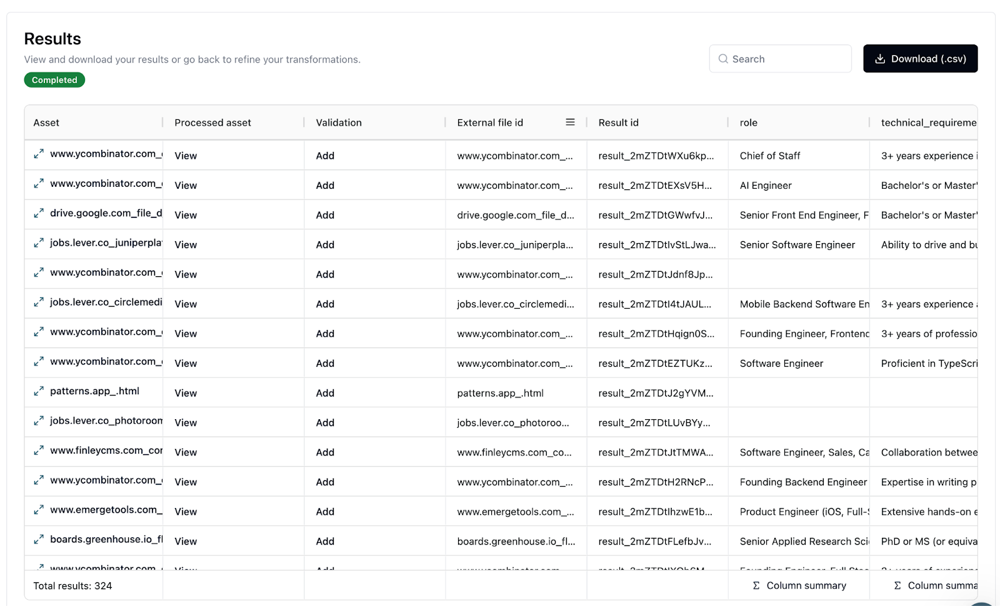

# Korvus x Trellis: Semantic search over YC jobs

<div align="left">

<figure><figcaption></figcaption></figure>

</div>

Silas Marvin

October 9, 2024
  
We're excited to bring you this detailed guide on leveraging the combined power of Trellis AI and Korvus to create a robust semantic search system for recent Y Combinator job listings.

In this tutorial, you'll discover how to:

* Use Trellis to extract structured data from Y Combinator's job listings  
* Process and index the extracted data using Korvus's powerful vector capabilities  
* Perform semantic search over the last 4 months of YC jobs

[Trellis AI](https://runtrellis.com/) is an innovative engine that transforms complex, unstructured data sources into clean, SQL-ready formats — ideal for creating structured datasets from varied inputs like financial documents, voice calls, and in our case, job listings.

[Korvus](https://github.com/postgresml/korvus) is a multi-language search SDK for PostgresML, offering Python, JavaScript, Rust, and C interfaces. For this project, we'll be harnessing its robust vector search functionality to enable semantic querying of our job data.

This powerful duo provides all you need to build a flexible and efficient semantic search system grounded in real-world job market data. By keeping your data and search capabilities in one place, you'll avoid the complexities of managing separate vector databases or additional frameworks.

Let's get started!

# Step 1 - Getting jobs

To begin our journey, we need to gather the raw data from Y Combinator's job listings. We've developed a Python script using Selenium and BeautifulSoup to scrape the last 4 months of job postings.

```python
from selenium import webdriver
from bs4 import BeautifulSoup
import time
import os

driver = webdriver.Chrome()


def get_rendered_html(url):
    driver.get(url)
    time.sleep(3)  # Wait for JavaScript to finish rendering (adjust time as needed)
    return driver.page_source


def extract_links_from_rendered_page(soup):
    links = []
    for span in soup.find_all("span", class_="titleline"):
        a_tag = span.find("a")
        if a_tag:
            links.append(a_tag["href"])
    return links


def save_html_to_file(url, content, folder):
    """Save the HTML content to a file in the specified folder."""
    # Create a valid filename based on the URL
    filename = url.replace("https://", "").replace("/", "_") + ".html"
    filepath = os.path.join(folder, filename)

    # Save the HTML content to the file
    with open(filepath, "w+") as file:
        file.write(content)
    print(f"Saved: {filepath}")


def scrape_pages(url, num_pages, output_folder):
    current_url = url
    for _ in range(num_pages):
        rendered_html = get_rendered_html(current_url)
        soup = BeautifulSoup(rendered_html, "html.parser")
        links = extract_links_from_rendered_page(soup)

        # Save the HTML of each job link
        for link in links:
            time.sleep(5)
            try:
                job_html = get_rendered_html(link)
                save_html_to_file(link, job_html, output_folder)
            except Exception as e:
                print(f"EXCEPTION: {e}")
                continue

        # Find the next page URL from the "More" link
        next_page = soup.find("a", class_="morelink")
        if next_page:
            current_url = "https://news.ycombinator.com/" + next_page["href"]
        else:
            break


if __name__ == "__main__":
    start_url = "https://news.ycombinator.com/jobs"
    num_pages = 9  # Set the number of pages to scrape
    output_folder = "scraped_html"  # Folder to save the HTML files

    scrape_pages(start_url, num_pages, output_folder)

driver.quit()  # Close the browser when done
```

Here's what our script does:  
1. Navigates to the Y Combinator jobs page using Selenium WebDriver  
2. Renders the potentially JavaScript-heavy page and extracts the HTML  
3. Parses the HTML with BeautifulSoup to find job listing links  
4. Visits each job listing page and saves its HTML content  
5. Repeats this process for multiple pages of job listings

The script is designed to handle pagination, ensuring we capture a comprehensive dataset. It also includes error handling and rate limiting to be respectful of the website's resources.

After running this script, we end up with a collection of HTML files in our \`scraped\_html\` folder. Each file contains the full content of a single job listing, including details like job title, company information, job description, and requirements.

This raw HTML data serves as the perfect input for Trellis AI, which will transform it into structured, easily searchable information in our next step.

# Step 2 - Extracting jobs with Trellis AI

With our raw HTML data in hand, we're ready to transform it into structured information using Trellis AI. Here's how we accomplish this:

1. Sign up and create a new project at runtrellis.com  
2. Upload our collected HTML files  
3. Create our transformation schema  
4. Run the transformation

Our transformation schema is designed to extract key information from each job listing, including roles, technical requirements, location, descriptions, and pay ranges. Here's a breakdown of what we're extracting:

* role: An array of job titles  
* technical_requirements: An array of technical skills required  
* location: The job's location  
* description: An array of job descriptions  
* company_description: A description of the company  
* pay_from and pay_to: The lower and upper limits of pay ranges

```json
{
  "model": "trellis-premium",
  "mode": "document",
  "table_preferences": {
    "included_table_names": []
  },
  "operations": [
    {
      "column_name": "role",
      "column_type": "text[]",
      "task_description": "Extract the roles of the job listings",
      "transform_type": "extraction"
    },
    {
      "column_name": "technical_requirements",
      "column_type": "text[]",
      "task_description": "Extract the technical requirements for each job",
      "transform_type": "extraction"
    },
    {
      "column_name": "location",
      "column_type": "text",
      "task_description": "Extract the location of the job",
      "transform_type": "extraction"
    },
    {
      "column_name": "description",
      "column_type": "text[]",
      "task_description": "Extract or generate the job descriptions",
      "transform_type": "generation"
    },
    {
      "column_name": "company_description",
      "column_type": "text",
      "task_description": "Extract or generate the description of the company listing the jobs",
      "transform_type": "generation"
    },
    {
      "column_name": "pay_from",
      "column_type": "text[]",
      "task_description": "Task: Extract the lower limit of pay ranges from job listings.\n- If a pay range is provided (e.g., \"80k-120k\" or \"$80,000-$120,000\"), extract the upper limit (e.g., 80000).\n- Do not mention equity\n- Output null if no lower limit or pay information is provided",
      "transform_type": "generation"
    },
    {
      "column_name": "pay_to",
      "column_type": "text[]",
      "task_description": "Task: Extract the upper limit of pay ranges from job listings.\n- If a pay range is provided (e.g., \"90k-120k\" or \"$80,000-$120,000\"), extract the upper limit (e.g., 120000).\n- If only equity is mentioned, extract the percentage and append \"equity\" (e.g., \"0.25% equity\").\n- Output null if no upper limit or pay information is provided.",
      "transform_type": "generation"
    }
  ]
}
```

Note that we're using text arrays (text\[\]) for several fields because a single HTML file may contain multiple job listings. This approach allows us to capture all the information without losing any details.

After running the transformation, we get a structured dataset that's ready for further processing and searching. 




we scraped might have led to 404 Not Found pages or other invalid content. Trellis AI handles these gracefully, allowing us to focus on the valid data in our next steps.

With our job data now in a clean, structured format, we're ready to move on to indexing and searching using Korvus.

# Step 3 - Ingesting and searching with Korvus

With our structured job data in hand, we're ready to leverage Korvus for ingestion and semantic search. Let's break down the process and examine the full Python script:

```python
import asyncio
import argparse
import pandas as pd
from rich import print
from typing import List, Dict
from korvus import Pipeline, Collection
import json


pipeline = Pipeline(
    "v0",
    {
        "summary": {
            "splitter": {"model": "recursive_character"},
            "semantic_search": {
                "model": "mixedbread-ai/mxbai-embed-large-v1",
            },
        },
    },
)
collection = Collection("yc_job_search_v1")


parser = argparse.ArgumentParser(description="YC Job Search Tool")
parser.add_argument("action", choices=["ingest", "search"], help="Action to perform")


def summarize(
    role,
    pay_to,
    pay_from,
    location,
    technical_requirements,
    description,
    company_description,
):
    return f"""{role}
Location:
{location}

Pay:
{pay_from} - {pay_to}

Technical Requirements:
{technical_requirements}

Job Description:
{description}

Company Description:
{company_description}"""


async def ingest_data():
    # Process the documents
    # Because we download it as a CSV we have to json.loads individual columns
    # This could be avoided if we used Trellis' API
    df = pd.read_csv("trellis_unstructured_data.csv")
    records = df.to_dict("records")
    documents = []
    for jobs in records:
        if jobs["role"] == "[]":
            continue
        roles = json.loads(jobs["role"])
        pay_tos = json.loads(jobs["pay_to"])
        pay_froms = json.loads(jobs["pay_from"])
        descriptions = json.loads(jobs["description"])
        technical_requirements = json.loads(jobs["technical_requirements"])
        for i, role in enumerate(roles):
            pay_to = pay_tos[i] if len(pay_tos) > i else "na"
            pay_from = pay_froms[i] if len(pay_froms) > i else "na"
            description = descriptions[i] if len(descriptions) > i else ""
            documents.append(
                {
                    "id": f"""{jobs["asset_id"]}_{i}""",
                    "summary": summarize(
                        role,
                        pay_to,
                        pay_from,
                        jobs["location"],
                        ",".join(technical_requirements),
                        description,
                        jobs["company_description"],
                    ),
                }
            )

    # Upsert the documents
    await collection.upsert_documents(documents)


async def search(query_text: str):
    results = await collection.search(
        {
            "query": {
                "semantic_search": {
                    "summary": {
                        "query": query_text,
                    },
                },
            },
            "limit": 5,
        },
        pipeline,
    )
    return results["results"]


async def search_loop():
    while True:
        query = input("Enter your search query (or 'q' to quit): ")
        if query.lower() == "q":
            break
        results = await search(query)
        print("[bold]Search Results:[/bold]")
        for result in results:
            print(
                result["document"]["summary"], end="\n\n"
            )  # TODO: Format the output as needed
            print("-".join("" for _ in range(0, 200)), end="\n\n")


async def main():
    args = parser.parse_args()

    if args.action == "ingest":
        await collection.add_pipeline(pipeline)
        await ingest_data()
    elif args.action == "search":
        await search_loop()


if __name__ == "__main__":
    asyncio.run(main())
```

Let's break down the key components of this script:

1. Setting up Korvus  
We initialize a Korvus Pipeline and Collection, using the mixedbread-ai/mxbai-embed-large-v1 model for semantic search.

2. Data Ingestion  
The `ingest_data()` function reads our Trellis output from a CSV file, processes each job listing, and creates a summary using the `summarize()` function. These summaries are then ingested into our Korvus collection.

3. Semantic Search  
The `search()` function implements Korvus's semantic search capabilities, allowing us to query our job data and return the top 5 most relevant results.

4. Interactive Search Loop  
The `search_loop()` function provides an interactive interface for users to continuously query the job data until they choose to quit.

To use this system, you can run the script with either the "ingest" or "search" action.

Let’s test it:

```
(venv) silas@MacBook-Pro-4 ~/P/p/postgresml-trellis> python3 main.py search
Enter your search query (or 'q' to quit): A job at a well established company in San Francisco
Search Results:
Staff Software Engineer
Location:
San Francisco, California, United States

Pay:
204138 - 276186

Technical Requirements:
7+ years of full stack software development experience,Advanced knowledge in NodeJs / Javascript and React (or similar languages/frameworks),Experience building scalable technical architecture that can scale to 1mm+ 
users (including observability tooling, container orchestration, etc),Experience with building security-first products from the ground up (e.g., best practices for authentication and rate limiting, considering how an
adversary might abuse attack surface),Experience integrating with third-party applications,Experience creating, maintaining, and operating microservices,Experience in securing and optimizing the applications you help
create,Experience developing platforms built using an asynchronous event-based architecture,Experience with a variety of payment rails, including ACH, instant push-to-debit,Mobile development experience with 
cross-platform frameworks

Job Description:
Collaborate with our leadership team and early adopters to design and implement new products

Company Description:
Checkr builds people infrastructure for the future of work. Established in 2014 and valued at $5B, Checkr puts modern technology powered by machine learning in the hands of hiring teams, helping thousands of 
companies like Uber, Instacart, Netflix, Compass Group, and Adecco to hire great new people with an experience that’s fast, smooth, and safe. Checkr has been recognized as one of BuiltIn's 2023 Best Places to Work in
the US and is a Y Combinator 2023 Breakthrough Company and Top Company by Valuation.... (4 more results truncated for readability)
```

It worked incredibly well\! We asked for `A job at a well established company in San Francisco` and we got exactly that\!

What we've demonstrated here is just the tip of the iceberg. To keep our example straightforward, we combined all extracted data into a single `summary` for embedding. However, the true power of Trellis shines when we leverage its fine-grained data extraction capabilities.

Imagine storing each piece of extracted information separately as metadata. We could then implement advanced filtering options alongside our semantic search. For instance, by preserving the lower and upper pay range limits as distinct fields, we could enable users to filter jobs by salary expectations in addition to their semantic queries.

This is where Trellis truly excels. Its ability to transform unstructured data into highly structured, queryable information opens up a world of possibilities.

# Wrapping up

In this guide, we've walked through the process of building a powerful semantic search system for Y Combinator job listings using Trellis AI and Korvus. We've seen how to:

1. Get job listings from Y Combinator's website  
2. Use Trellis AI to extract structured data from raw HTML  
3. Leverage Korvus to ingest this data and perform semantic searches

This combination of tools allows us to quickly build a robust system that can understand and query job listings based on their meaning, not just keywords. It demonstrates the power of modern AI tools in transforming unstructured web data into actionable insights.

By using Trellis for data extraction and Korvus for vector search, we've created a flexible, efficient solution that doesn't require managing separate vector databases or complex frameworks. This approach can be easily adapted to other datasets or use cases, opening up a world of possibilities for AI-powered data analysis.

We hope this guide inspires you to explore these tools and create your own innovative applications. Happy coding!
