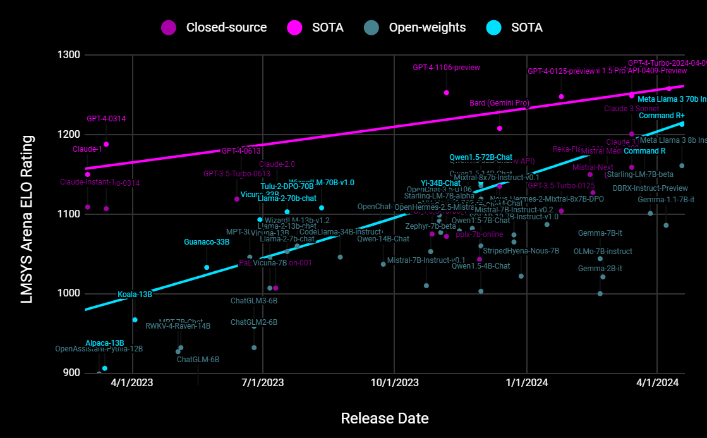
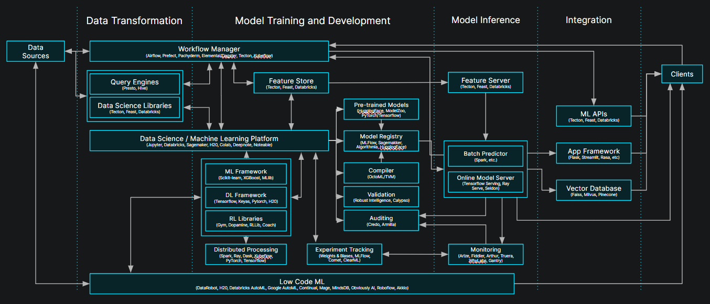
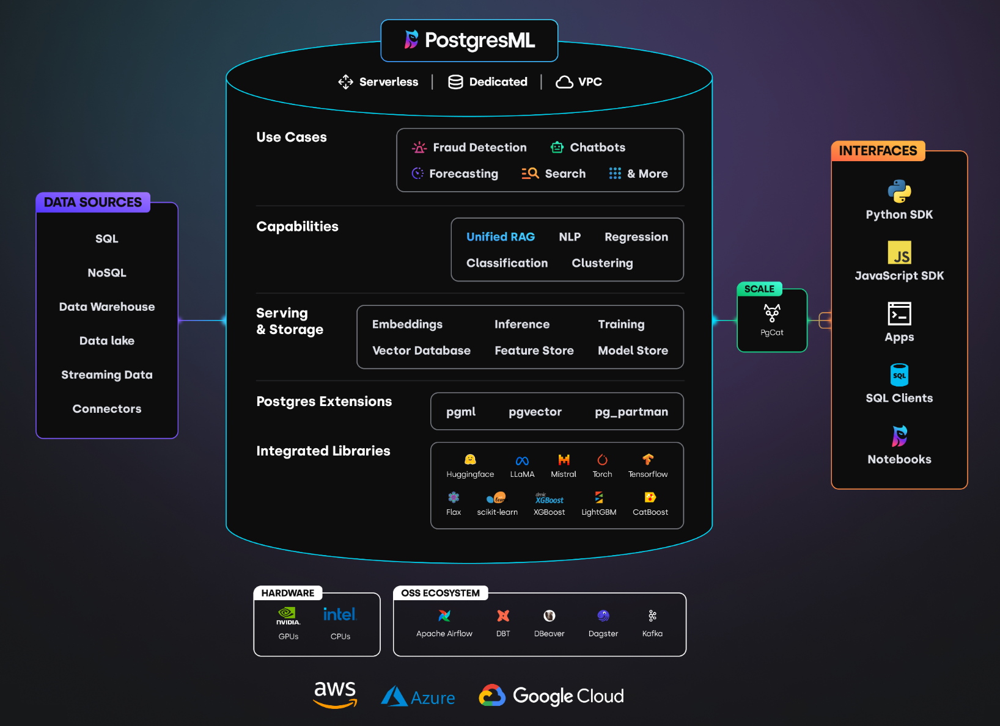

# LLMs are Commoditized; Data is the Differentiator

<figure><figcaption></figcaption></figure>

Montana Low

April 26, 2024

## Introduction

Last year, OpenAI’s GPT-4 launched to great fanfare and was widely hailed as the arrival of AI. Last week, Meta’s Llama 3 surpassed the launch performance of GPT-4, making AI truly available to all with an open-weight model.

The closed-source GPT-4 is rumored to be more than 1 trillion parameters, more than 10x larger and more expensive to operate than the latest 70 billion open-weight model from Meta. Yet, the smaller open-weight model achieves indistinguishable quality responses when judged by English speaking human evaluators in a side-by-side comparison. Meta is still training a larger 405B version of Llama 3, and plans to release the weights to the community in the next couple of months.

Not only are open-weight models leading in high-end performance, further optimized and scaled down open-weight versions are replacing many of the tasks that were only serviceable by proprietary vendors last year. Mistral, Qwen, Yi and a host of community members regularly contribute high quality fine-tuned models optimized for specific tasks at a fraction of the operational cost.

<figure><figcaption>GPT-4 progress has stagnated across recent updates. We look forward to continuing the trend lines when Llama 3 405B and other models are tested soon.</figcaption></figure>

## Increasing Complexity

At the same time, few of the thinly implemented LLM wrapper applications survived their debut last year. Quality, latency, security, complexity and other concerns have stymied many efforts.

The machine learning infrastructure required to deliver value continues to grow increasingly complex, despite or perhaps because of advances on multiple fronts. Tree based approaches still outperform LLMs on tabular data. Older, encoder models can easily handle tasks like sentiment analysis orders of magnitude more efficiently. LLMs and vector databases are a couple of the many commoditized components of the machine learning stack, part of a toolkit that continues to grow.

<figure><figcaption>Original diagram credit to a16z.com</figcaption></figure>

The one aspect that remains consistent is that data differentiates open-source algorithms and models. In the modern age of LLMs, fine-tuning, RAG, re-ranking, and RLHF; they all require data. Implementing high quality search, personalization, recommendation, anomaly detection, forecasting, classification and so many more use cases, all depend on the data.

The hard part of AI & ML systems has always been managing that data. Vastly more engineers have a full-time job managing data pipelines than models. Vastly more money is spent on data management systems than LLMs, and this will continue to be the case, because data is the bespoke differentiator.

Getting the data to the models in a timely manner often spans multiple teams and multiple disciplines collaborating for multiple quarters. When the landscape is changing as quickly as modern AI & ML, many applications are out of date before they launch, and unmaintainable long term. Unfortunately, for those teams, the speed of innovation is only increasing.

Keeping up with the latest innovations in just one small area of the field is a full time job, and wiring all of those together with ever-changing business requirements is a bunch of other people’s. That’s the force that created the previous diagram with a ton of siloed solutions and interconnections. Only the most lucrative businesses can afford the engineers and services required by the status quo.

### _Move models to the data, rather than constantly pulling data to the models_

In-database machine learning represents a strategic shift to leverage data more effectively. By enabling machine learning operations directly within database environments, even organizations outside of the “magnificent seven” can make real-world applications that are more efficient, effective and reactive to real-time data changes. How?

- *Reduced engineering overhead* Eliminate the need for an excess of engineers managing data pipelines full-time.
- *Increased efficiency* Reduce the number of external network calls from your data to the models, which are costly in both speed, spend, and uptime.
- *Enhanced security* No need to send your data to multiple third parties, or worry about new attack vectors on unproven technology.
- *Scalability* Store and scale your data with a proven platform handling millions of requests per second and billion row datasets.
- *Flexibility* Open-weight models on an open source platform gives you greater control for upgrades, use cases and deployment options.

## How PostgresML fits in
We built PostgresML after a series of hard lessons learned building (and re-building) and then scaling the machine learning platform at Instacart during one of the companies’ highest-ever growth periods. At the end of the day, nothing worked better than building it all on a trusted, 35-year-old RDBMS. That’s why I’m confident that in-database machine learning is the future of real-world AI applications.

PostgresML brings AI & ML capabilities directly into a PostgreSQL database. It allows users to train, deploy, and predict using models inside the database. It’s all the benefits of in-database machine learning, packaged in a few easy to access ways. You can use our open-source extension or our hosted cloud. You can get started quickly with SDKs in Python and JavaScript, or you can get complete AI & ML capabilities with just a few SQL calls. That means generating embeddings, performing vector operations, using transformers for NLP – all directly where your data resides.   Real-world applications range from predicting customer behaviors to automating financial forecasts.

<figure></figure>

## Conclusion
The practical benefits of in-database machine learning are many, and we built PostgresML to deliver those benefits in the simplest way. By running LLMs and other predictive models inside the database, PostgresML enhances the agility and performance of software engineering teams. For developers, this means less context switching and greater ease of use, as they can manage data and model training in the environment they are already familiar with. Users benefit from reduced latency and improved accuracy in their predictive models. Organizations benefit from more performant applications, but also from the flexibility of a platform that can be easily updated with the latest models once a week rather than once a year.

Feel free to give PostgresML a try and let us know what you think. We’re open source, and welcome contributions from the community, especially when it comes to the rapidly evolving ML/AI landscape.
