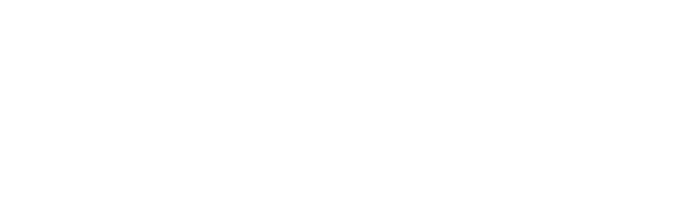

# Semantic Search in Postgres in 15 Minutes

<div align="left">

<figure><figcaption></figcaption></figure>

</div>

Silas Marvin

June 15, 2024

## What is and is not semantic search

Semantic search uses machine learning to understand the meaning of text by converting it into numerical vectors, allowing for more accurate and context-aware search results.

When users are unsure of the exact terms to search for, semantic search can uncover relevant information that traditional keyword searches might miss. This capability is particularly valuable for discovering content based on the intent and context of the search query, rather than relying solely on precise word matches.

It is not a replacement for full-text search. In many cases, full-text search can outperform semantic search. Specifically, if a user knows the exact keywords they want to match in a document, full-text search is faster and guaranteed to return the correct result, whereas semantic search is only likely to return the correct result. Full-text search and semantic search can be combined to create powerful and robust search systems.

Semantic search is not just for machine learning engineers. The system behind semantic search is relatively easy to implement, and thanks to new Postgres extensions like `pgml` and `pgvector`, it is readily available to SQL developers. Just as modern SQL developers are expected to be familiar with and capable of implementing full-text search, they will soon be expected to implement semantic search as well.

## Embeddings 101

Semantic search is powered by embeddings. To understand how semantic search works, we must have a basic understanding of embeddings. 

Embeddings are vectors. Given some text and some embedding model, we can convert text to vectors:

!!! generic

!!! code_block

```postgresql
SELECT pgml.embed('mixedbread-ai/mxbai-embed-large-v1', 'Generating embeddings in Postgres is fun!');
```

!!! 

!!! results

```text
{-0.12269165,0.79433846,0.1909454,-0.8607215,-0.5526149,-0.48317516,0.48356333,0.40197256,0.6542712,0.20637313,0.68719935,-0.11798598,0.3924242,-0.3669872,-0.37829298,-0.57285887,-0.42399693,-0.57672346,-0.5584913,-0.25157344,-0.26103315,0.8435066,-1.3652948,-0.060239665,0.053472117,0.61965233,0.70429814,0.21168475,2.1243148,0.54657197,0.44898787,0.5141667,0.25056657,-0.7296713,-0.21511579,-0.26193422,0.18050511,0.42497447,0.10701023,-0.47321296,0.88108975,-0.23380123,0.097806804,-0.7617625,-1.7238936,0.0734859,0.5393925,0.08824284,0.6490631,-0.6999467,-0.04020539,0.34580526,-0.22457539,-0.1596002,0.30769205,0.10054478,-0.21030527,-0.6795052,-0.49133295,0.64051557,0.729387,-0.28649548,0.6304755,-1.2938358,0.18542609,-0.1447736,0.26269862,-0.7243509,-0.3743654,0.32034853,-0.033665977,-0.101480104,-0.40238166,-0.13823868,-0.08293891,0.18822464,0.614725,-0.51620704,-0.9493647,0.34618157,-0.045119785,0.5292574,0.24998534,0.50182945,-0.66819376,-0.69498116,1.0365546,0.7618454,0.22734495,-0.3371644,0.18830177,0.65933335,0.90198004,0.62203044,-0.18297921,0.80193377,-0.3250604,0.7243765,0.42883193,0.21042423,-0.01517533,0.5617572,-0.1593908,0.25845265,-0.07747603,0.4637758,0.3156056,-0.8067281,0.20704024,0.26316988,0.26273122,-0.32277155,0.16489738,-0.025123874,-0.8421937,0.42238364,-0.20360216,0.7395353,-0.28297424,-0.58514386,-1.1276962,-0.57587785,0.7367427,-1.183229,-0.17403314,-1.3642671,0.06204233,0.83101535,-0.8367251,0.4434241,0.13569412,-0.5018109,-0.24702606,0.2925449,-0.30402657,0.30018607,-0.8272239,0.7552851,0.71613544,-0.5800097,0.4300131,-0.3769249,0.15121885,1.4300121,-0.70190847,-0.014502372,1.1501042,-0.91252214,-1.299539,1.5988679,0.29511172,-0.3301541,0.10612632,0.48639655,-0.67100185,-0.18592787,-0.0610746,-0.40246755,0.34081936,0.26820442,-0.1269026,-0.02156586,0.10375944,0.6626627,-0.18523005,0.96837664,-0.5868682,0.081125714,-0.62061644,-1.010315,-0.18992952,-0.034805447,0.3482115,0.10850326,0.7015801,1.181063,0.51085556,-0.3421162,1.1605215,0.34367874,-0.45851547,-0.23464307,0.22397688,0.5295375,-0.067920305,0.38869885,-0.764097,0.08183036,-0.74270236,0.1314034,-0.09241337,0.7889378,-0.4487391,0.2671574,-0.057286393,0.23383318,-0.64422816,0.31305853,-0.5284081,-0.8764228,-1.0072867,0.7426642,0.20632008,0.19519271,-0.20781143,-0.55022776,-0.7449971,0.8095787,-1.1823708,-0.12114787,0.7764435,-0.4102213,-0.5614735,-1.151166,0.453138,-0.124295816,-0.7787184,0.8213192,0.19523725,-0.3429081,-0.5960741,0.05939262,0.6634549,-0.10354193,-0.16674386,0.23894079,0.5281129,0.4417929,-0.052335966,0.26073328,-0.5175538,0.43219882,0.42117482,0.9145017,0.62297195,0.5059562,1.0199716,0.33026397,0.10540544,1.4194826,0.2387192,-0.24473047,-0.12635238,0.38584706,0.06950318,0.13178644,0.4950382,0.58716995,-0.22241667,0.28335956,-1.4205463,-0.37189013,-0.006335424,0.674547,-0.35189858,-0.06895771,0.33660728,0.6581518,-0.5726849,0.20706958,-0.63431185,0.55616635,-0.3150213,0.18246625,0.6179018,0.3199304,0.1705371,0.40476194,-0.49592853,-0.00519022,-0.98531955,-0.8100823,-0.58652925,0.10230886,-0.7235388,-0.6156084,0.2809807,-0.2967379,-0.3508671,-1.1141659,-0.22769807,0.08822136,-0.23333925,0.6282077,1.0215682,0.38222972,-1.1630126,0.4021485,-0.064744614,1.0170162,-0.6086199,0.32332307,0.3160495,0.37213752,0.23822482,-0.24534902,-0.35759526,0.16281769,0.20119011,-0.7505329,-0.53170776,0.52023965,0.34757367,-0.3365119,-1.090554,0.74303913,0.7576997,0.1850476,0.38377324,0.6341742,0.0035892723,0.17847057,-0.52225345,0.4744198,-0.7825479,0.85714924,1.2160783,0.05176344,-0.34153363,-0.9228027,-0.45701292,-0.31697652,0.18669243,-0.080539,-0.97618884,0.44975403,0.12266389,-1.5476696,0.10114262,0.2652986,-0.6647504,-0.11139665,0.09672374,0.3067969,0.124992974,-0.075039916,-0.945483,-0.08019136,0.33150327,0.79691124,0.32509813,-0.7345915,0.49151382,0.8019188,0.054724086,0.3824057,0.54616,-1.338427,-0.17915602,0.29255223,-0.1312647,0.17714119,0.9686431,0.5271556,-0.09237713,-0.14801571,-0.8311881,0.4603313,1.173417,-0.17329413,1.1544656,1.2609864,0.6680077,-0.7116551,-0.26211533,-0.6321865,-0.4512319,0.30350694,0.7740681,-1.0377058,0.5507171,0.08685625,-0.4665991,1.0912793,-0.4253514,-1.3324647,0.6247509,0.17459206,0.64427835,-0.1543753,-0.4854082,0.42142552,0.41042453,0.80998975,-0.025750212,0.8487763,0.29716644,-0.8283788,-0.702183,-0.15909031,-0.4065299,1.064912,-0.25737965,-0.22743805,-1.1570827,0.17145145,0.38430393,0.82506144,0.46196732,-0.101009764,0.7100557,0.37232363,0.2594003,0.19210479,0.36719602,0.75960565,-0.65713775,0.23913959,0.692282,-0.41791838,0.47484493,0.17821907,-0.60062724,0.29957938,-0.11593854,0.32937768,-0.45972684,0.01129646,0.18534593,0.62680054,-0.028435916,0.251009,-0.71900076,0.44056803,0.16914998,-1.0019057,-0.55680645,0.059508275,0.20963086,0.06784629,0.07168728,-0.93063635,-0.045650747,-0.007684426,-0.7944553,0.79666996,0.9232027,-0.0643565,0.6617379,-1.1071137,0.35533053,-0.5851006,0.7480103,0.18149409,0.42977095,0.28515843,-0.29686522,0.9553224,0.7197761,-0.6413751,-0.17099445,-0.544606,0.06221392,-0.24136083,-0.5460586,-0.40875596,-0.057024892,-0.31573594,-0.01389576,-0.010156465,0.5784532,-0.44803303,0.38007888,-0.38199085,-0.43404552,0.91768897,-0.09181415,-0.44456294,0.28143787,0.6168798,-0.34374133,0.43424013,0.39190337,-0.56925493,0.8975914,-0.27520975,0.82481575,-0.16046512,-0.21151508,0.013323051,-0.60130703,0.19633308,-0.07837379,-0.16391036,-0.80348927,-1.6232564,-0.123514965,-0.15926442,-0.9025081,0.47055957,-0.078078784,-0.30613127,1.0725194,-0.5127652,-0.26803625,0.2473333,-0.43352637,0.26197925,0.47239286,0.3917152,0.13200012,-0.021115797,-1.3560157,-0.15067065,-0.23412828,0.24189733,-0.7706759,-0.3094795,-0.17276037,0.11040486,-1.122779,-0.8549858,-0.8815358,0.36725566,0.4391438,0.14913401,-0.044919793,-0.90855205,-1.2868156,0.86806804,0.013447602,-1.3518908,-1.0878333,1.1056291,-0.6054898,0.8732615,0.090048715,0.3439396,-0.43436176,-1.4296948,0.21427931,-0.56683505,-0.7287918,-0.66875815,-1.2414092,0.14564492,0.14575684,1.6843026,-0.7691825,-0.8857156,-0.59383214,0.1526336,-0.40446484,-0.093765385,-0.57902026,0.7115043,-0.2987314,1.4434578,-0.7507225,-0.14864576,0.09993563,0.3642726,0.39022216,1.4126799,-0.39582014,-0.46609184,-0.119693935,-0.7797329,0.8846008,-0.008525363,-1.1169624,0.28791374,-0.64548826,-0.14354923,-0.9195319,0.5042809,-0.64800096,-0.566263,0.31473473,-1.3200041,0.066968784,-1.2279652,0.6596321,-0.22676139,0.05292237,-0.44841886,-0.14407255,-1.1879731,-0.9624812,0.3520917,-0.8199045,-0.23614404,0.057054248,0.2774532,0.56673276,-0.68772894,0.8464806,1.0946864,0.7181479,-0.08149687,-0.033113156,-0.45337513,0.6593971,0.040748913,0.25708768,0.2444611,-0.6291184,0.2154976,-1.0344702,-0.57461023,-0.22907877,0.20212884,1.5542895,-0.69493115,0.76096123,-0.27198875,-0.28636566,-0.80702794,-0.09504783,0.5880213,0.52442694,0.88963073,-0.113876544,0.44108576,0.5131936,-0.51199615,-0.5373556,-0.50712276,0.7119059,0.26809675,-0.624161,0.50190353,0.45905492,-0.7560234,-0.36166972,-0.11057704,-0.93385667,0.14702824,-0.5007164,0.062319282,0.14635088,-0.60926783,0.44830725,0.5508014,-0.18144712,0.8553549,0.4763656,-0.06791675,-0.7282673,0.5312333,0.29696235,-0.32435995,0.11339427,-0.3156661,0.21376118,0.101174735,0.49239466,0.31915516,0.7523039,0.015413809,1.1970537,1.2595433,0.7877007,-0.77948576,-0.07308315,-0.005401653,-0.9297423,-0.6518283,-0.5235209,-0.08294889,-0.32686272,0.81800294,0.28346354,0.23243074,1.211297,0.5740814,-0.23115727,-1.0199192,-0.11423441,-1.2686234,-0.3610325,-0.13443044,-0.09186939,-0.46258482,-0.2746501,0.039179135,-0.6018465,-0.8123009,0.65863043,-1.4951158,0.04137505,-0.39956668,-0.21086998,-0.16921428,-0.12892427,-0.07058203,0.22937924,0.1872652,0.24946518,0.06469146,0.69964784,-0.14188632,0.57223684,0.26891342,-0.27864167,-0.5591145,-0.79737157,-1.0706135,-0.2231602,-1.108503,-0.34735858,-0.032272782,-0.38188872,0.32032675,0.6364613,-0.38768604,-1.1507906,-0.913829,0.36491016,0.25496644,-0.06781126,-0.84842575,0.0793298,0.0049917502,0.07099934,-0.5054571,-0.55416757,-0.4953387,0.47616813,0.13400371,1.3912268,0.30719018,-0.16337638,0.18637846,-0.19401097,0.71916217,-0.21031788,0.61066073,-0.43263736,-0.54376316,-0.36609605,0.30756727,0.3625213,0.30662173,-0.109407134,-0.26726124,-0.10782864,-0.5728887,0.35624364,0.23127197,1.0006613,-0.18430339,0.24659279,-0.1414664,-0.9362831,-0.14328903,-0.76222867,-1.6322204,-0.23277596,1.1940688,-0.5248364,0.6987823,0.36069974,-0.38930154,0.31739354,0.8688939,0.25019056,-0.45539424,0.5829257,-0.35556546,-0.23837212,-0.74019665,-0.49967116,0.20733729,0.18190496,-0.84233344,-0.9670267,0.29291785,0.18208896,0.26272357,0.076004505,0.16490388,0.23035681,-0.05491554,-0.35777965,-0.06495173,0.84074193,-0.06649489,0.5308439,-0.27389482,0.52712023,-0.70385605,1.582289,0.3533609,0.6537309,-0.11627128,1.1282475,-0.12714477,0.61138934,1.0615714,0.6239467,0.54578096,-0.56903726,-0.09996867,0.29148775,0.4719238,0.52982926,-0.122312695,-0.59448034,1.1922164,-0.102847695,0.015887707,-0.46900386,0.9373753,0.5174408,0.107704684,0.33192438,-0.73113894,-0.07725855,-0.21073207,-0.53892136,-0.41692436,0.04440565,-0.7362955,-0.18671799,-0.617404,0.11175289,-0.03757055,-0.9091465,-0.4772941,0.115955085,-0.109630615,0.27334505,-0.15329921,-0.40542892,0.6577188,-0.14270602,0.028438624,0.7158844,-0.04260146,0.14211391,0.36379516,-0.16956282,-0.32750866,0.7697329,-0.31624234,-0.81320703,-0.18005963,0.6081982,0.23052801,-0.20143141,0.24865282,-0.5117264,-0.64896625,-0.664304,0.4412688,-0.74262285,0.31758395,1.0110188,-0.0542792,-0.12961724,0.038787734,-0.019657299,0.3522628,0.88944745,0.7572078,0.4543937,0.31338966,2.1305785,0.11285806,0.9827753,0.4258123,0.46003717,0.01849649,-0.050423466,-0.7171815,-0.31475943,-0.48302308,-1.342478,0.017705658,0.3137204,0.43893284,-0.31969646,0.26008397,0.86090857,-0.9084142,0.47359383,1.2101759,0.25754166,0.071290456,-0.19756663,-0.07539108,-0.6719409,0.404817,-0.992041,0.48930237,0.83036274,-1.0315892,-0.06564829,0.00026013568,-0.43265438,-0.55953914,-0.06504767,-0.6801495,0.57494533,0.6398298,0.46862775,0.04649162,-0.70052904,-0.24009219,0.52453166,0.79875654,-0.09534484,0.82706153,0.96052814,0.1742728,0.057494655,-0.21722038,0.21895333,-0.15573184,0.5323167,-0.11215742,0.23329657,-0.566671,-0.7952302,0.31211463,0.40420142,0.32071197,-0.9692792,-0.27738753,0.35658348,-0.23604108,-0.5778135,-1.2452201,0.18487398,0.28343126,0.034852847,-0.42560938,-0.87293553,3.3916373,0.37104064,0.95921576,0.30020702,0.43176678,0.4746065,0.8066563,0.02344249,0.6768376,-1.243408,0.013419566,0.26038718,0.052325014,0.40021995,0.69684315,0.17993873,-0.6125471,0.39728552,0.1287264,-0.821042,-0.6356886,0.04368836,0.58837336,0.2951825,0.80620193,-0.55552566,-0.27555013,-0.86757773,-0.33467183,0.07901353,0.20590094,0.095205106,0.5052767,-0.3156328,-0.054386012,0.29206502,-0.26267004,-1.1437016,0.037064184,0.5587826,-0.23018162,-0.9855164,0.007280944,-0.5550629,-0.46999946,0.58497715,-0.1522534,0.4508725,0.37664524,-0.72747505,-0.52117777,-0.8577786,0.77468944,-1.2249953,-0.85298705,-0.8583468,-0.5801342,-0.817326,0.16878682,1.3681034,-0.6309237,0.42270342,-0.11961653,0.36134583,0.459141,0.24535258,0.21466772,-0.45898587,-0.20054409,-0.92821646,-0.05238323,0.17994325,0.82358634,-1.1087554,0.55523217,-0.29262337,-0.7871331,0.7758087,-0.2988389,-0.14875472,-0.731297,-0.46911976,-0.5939936,0.39334157,-0.2833826,0.64205635,-0.21212497,0.31960186,0.25826675,0.94142056,-0.15007028,0.7186352,-0.13642757,0.4422678,-0.106289506}
```

!!!

!!!

We used the [pgml.embed](/docs/api/sql-extension/pgml.embed) PostresML function to generate an embedding of the sentence "Generating embeddings in Postgres is fun!" using the [mixedbread-ai/mxbai-embed-large-v1](https://huggingface.co/mixedbread-ai/mxbai-embed-large-v1) model from mixedbread.ai.

The output size of the vector varies per model, and in _mxbai-embed-large-v1_ outputs vectors with 1024 dimensions: each vector contains 1024 floating point numbers. 

The vector this model outputs is not random. It is designed to capture the semantic meaning of the text. What this really means, is that sentences which are closer together in meaning will be closer together in vector space. 

Let’s look at a more simple example. Let's assume we have a model called `simple-embedding-model`, and it outputs vectors with only 2 dimensions. Let’s embed the following three phrases: "I like Postgres", "I like SQL" and "Rust is the best": 

!!! generic

!!! code_block

```postgresql
SELECT pgml.embed('simple-embedding-model', 'I like Postgres') AS embedding;

SELECT pgml.embed('simple-embedding-model', 'I like SQL') AS embedding;

SELECT pgml.embed('simple-embedding-model', 'Rust is the best') AS embedding;
```

!!!

!!! results

```text
embedding for 'I like Postgres'
---------
[0.1, 0.2]

embedding for 'I like SQL'
---------
[0.12, 0.25]

embedding for 'Rust is the best'
---------
[-0.8, -0.9]
```

!!!

!!!

You'll notice how similar the vectors produced by the text "I like Postgres" and "I like SQL" are compared to "Rust is the best".  This is a artificial example, but the same idea holds true when translating to real models like _mixedbread-ai/mxbai-embed-large-v1_. 

## What does it mean to be "close"?

We can use the idea that text that is more similar in meaning will be closer together in the vector space to build our semantic search engine. 

For instance let’s say that we have the following documents:

| Document ID | Document text |
-----|----------|
| 1 | The pgml.transform function is a PostgreSQL function for calling LLMs in the database. |
| 2 | I think tomatoes are incredible on burgers. |


and a user is looking for the answer to the question: "What is the pgml.transform function?". If we embed the search query and all of the documents using a model like _mixedbread-ai/mxbai-embed-large-v1_, we can compare the query embedding to all of the document embeddings, and select the document that has the closest embedding in vector space, and therefore in meaning, to the to the answer. 

These are big embeddings, so we can’t simply estimate which one is closest. So, how do we actually measure the similarity (distance) between different vectors?

_pgvector_ as of this writing supports four different measurements of vector similarity:

- L2 distance
- (negative) inner product
- cosine distance
- L1 distance

For most use cases we recommend using the cosine distance as defined by the formula:

<figure><figcaption></figcaption></figure>

where A and B are two vectors. 

This is a somewhat confusing formula but luckily  _pgvector_ provides an operator that computes the cosine distance for us:

!!! generic

!!! code_block

```postgresql
SELECT '[1,2,3]'::vector <=> '[2,3,4]'::vector;
```

!!!

!!! results

```text
   cosine_distance    
----------------------
 0.007416666029069763
```

!!!

!!!

Other distance functions have similar formulas and provide convenient operators to use as well. It may be worth testing other operators and to see which performs better for your use case. For more information on the other distance functions, take a look at our [Embeddings guide](https://postgresml.org/docs/guides/embeddings/vector-similarity).

Going back to our search example, we can compute the cosine distance between our query embedding and our documents:

!!! generic

!!! code_block

```postgresql
SELECT pgml.embed(
  'mixedbread-ai/mxbai-embed-large-v1',
  'What is the pgml.transform function?'
)::vector
  <=>
pgml.embed(
  'mixedbread-ai/mxbai-embed-large-v1',
  'The pgml.transform function is a PostgreSQL function for calling LLMs in the database.'
)::vector AS cosine_distance;

SELECT pgml.embed(
  'mixedbread-ai/mxbai-embed-large-v1',
  'What is the pgml.transform function?'
)::vector
  <=>
pgml.embed(
  'mixedbread-ai/mxbai-embed-large-v1',
  'I think tomatoes are incredible on burgers.'
)::vector AS cosine_distance;
```

!!!

!!! results

```text
cosine_distance   
--------------------
 0.1114425936213167

cosine_distance   
--------------------
 0.7328613577628744
```

!!!

!!!

You'll notice that the distance between "What is the pgml.transform function?" and "The pgml.transform function is a PostgreSQL function for calling LLMs in the database." is much smaller than the cosine distance between "What is the pgml.transform function?" and "I think tomatoes are incredible on burgers".

## Making it fast!

It is inefficient to compute embeddings for all the documents every time we search the dataset. Instead, we should embed our documents once and search against precomputed embeddings. 

_pgvector_ provides us with the `vector` data type for storing embeddings in regular PostgreSQL tables:


!!! generic

!!! code_block time="12.547 ms"

```postgresql
CREATE TABLE text_and_embeddings (
    id SERIAL PRIMARY KEY, 
    text text, 
    embedding vector (1024)
);
```

!!!

!!!

Let's add some data to our table:

!!! generic

!!! code_block time="72.156 ms"

```postgresql
INSERT INTO text_and_embeddings (text, embedding)
VALUES 
  (
    'The pgml.transform function is a PostgreSQL function for calling LLMs in the database.',
    pgml.embed(
      'mixedbread-ai/mxbai-embed-large-v1',
      'The pgml.transform function is a PostgreSQL function for calling LLMs in the database.'
    )
  ),

  (
    'I think tomatoes are incredible on burgers.',
    pgml.embed(
      'mixedbread-ai/mxbai-embed-large-v1',
      'I think tomatoes are incredible on burgers.'
    )
  );
```

!!!

!!!

Now that our table has some data, we can search over it using the following query: 

!!! generic

!!! code_block time="35.016 ms"

```postgresql
WITH query_embedding AS (
    SELECT
        pgml.embed(
          'mixedbread-ai/mxbai-embed-large-v1',
          'What is the pgml.transform function?',
          '{"prompt": "Represent this sentence for searching relevant passages: "}'
        )::vector embedding
)
SELECT
    text,
    (
        SELECT
          embedding
        FROM query_embedding
    ) <=> text_and_embeddings.embedding cosine_distance
FROM
  text_and_embeddings
ORDER BY cosine_distance
LIMIT 1;
```

!!!

!!! results

```
                                          text                                          |   cosine_distance   
----------------------------------------------------------------------------------------+---------------------
 The pgml.transform function is a PostgreSQL function for calling LLMs in the database. | 0.13467974993681486
```

!!!

!!!

This query is fast for now, but as we add more data to the table, it will slow down because we have not indexed the embedding column. 

Let's demonstrate this by inserting 100,000 additional embeddings:

!!! generic

!!! code_block time="3114242.499 ms"

```postgresql
INSERT INTO text_and_embeddings (text, embedding) 
SELECT
  md5(random()::text),
  pgml.embed(
    'mixedbread-ai/mxbai-embed-large-v1',
    md5(random()::text)
  ) 
FROM generate_series(1, 100000);
```

!!!

!!!

Now trying our search engine again:

!!! generic

!!! code_block time="138.252 ms"

```postgresql
WITH embedded_query AS (
    SELECT
        pgml.embed('mixedbread-ai/mxbai-embed-large-v1', 'What is the pgml.transform function?', '{"prompt": "Represent this sentence for searching relevant passages: "}')::vector embedding
)
SELECT
    text,
    (
        SELECT
            embedding
        FROM embedded_query) <=> text_and_embeddings.embedding cosine_distance
FROM
  text_and_embeddings
ORDER BY cosine_distance
LIMIT 1;
```

!!!

!!! results

```
                                          text                                          |   cosine_distance   
----------------------------------------------------------------------------------------+---------------------
 The pgml.transform function is a PostgreSQL function for calling LLMs in the database. | 0.13467974993681486
```

!!!

!!!

This somewhat less than ideal performance can be fixed by indexing the embedding column. There are two types of indexes available in `pgvector`: IVFFlat and HNSW.

IVFFlat indexes clusters the table into sublists, and when searching, only searches over a fixed number of sublists. In our example, if we were to add an IVFFlat index with 10 lists:

!!! generic

!!! code_block time="4989.398 ms"

```postgresql
CREATE INDEX ON text_and_embeddings
USING ivfflat (embedding vector_cosine_ops)
WITH (lists = 10);
```

!!!

!!!

and search again, we would get much better performance:

!!! generic

!!! code_block time="44.508 ms"

```postgresql
WITH embedded_query AS (
    SELECT
        pgml.embed('mixedbread-ai/mxbai-embed-large-v1', 'What is the pgml.transform function?', '{"prompt": "Represent this sentence for searching relevant passages: "}')::vector embedding
)
SELECT
    text,
    (
        SELECT
            embedding
        FROM embedded_query) <=> text_and_embeddings.embedding cosine_distance
FROM
  text_and_embeddings
ORDER BY cosine_distance
LIMIT 1;
```

!!!

!!! results

```
                                          text                                          |   cosine_distance   
----------------------------------------------------------------------------------------+---------------------
 The pgml.transform function is a PostgreSQL function for calling LLMs in the database. | 0.13467974993681486
```

!!!

!!!

We can see it is a massive speedup because we are only searching over 1/10th of the original vectors! 

HNSW indexes are a bit more complicated. It is essentially a graph with edges linked by proximity in vector space. For more information you can check out this [write-up](https://www.pinecone.io/learn/series/faiss/hnsw/). 

HNSW indexes typically have better and faster recall but require more compute when adding new vectors. That being said, we recommend using HNSW indexes for most use cases.

!!! generic

!!! code_block time="115564.303"

```postgresql
DROP index text_and_embeddings_embedding_idx;

CREATE INDEX ON text_and_embeddings
USING hnsw (embedding vector_cosine_ops);
```

!!!

!!!

Now let's try searching again:

!!! generic

!!! code_block time="35.716 ms"

```postgresql
WITH embedded_query AS (
    SELECT
        pgml.embed(
          'mixedbread-ai/mxbai-embed-large-v1',
          'What is the pgml.transform function?',
          '{"prompt": "Represent this sentence for searching relevant passages: "}'
        )::vector embedding
)
SELECT
    text,
    (
        SELECT
          embedding
        FROM embedded_query
    ) <=> text_and_embeddings.embedding cosine_distance
FROM
  text_and_embeddings
ORDER BY cosine_distance
LIMIT 1;
```

!!!

!!! results

```
                                          text                                          |   cosine_distance   
----------------------------------------------------------------------------------------+---------------------
 The pgml.transform function is a PostgreSQL function for calling LLMs in the database. | 0.13467974993681486
```

!!!

!!!

That was even faster!

There is a lot more that can go into semantic search. Stay tuned for a follow up post on hybrid search and re-ranking.

If you have any questions, or just have an idea on how to make PostgresML better, we'd love to hear from you in our [Discord](https://discord.com/invite/DmyJP3qJ7U). We’re open source, and welcome contributions from the community, especially when it comes to the rapidly evolving ML/AI landscape.
