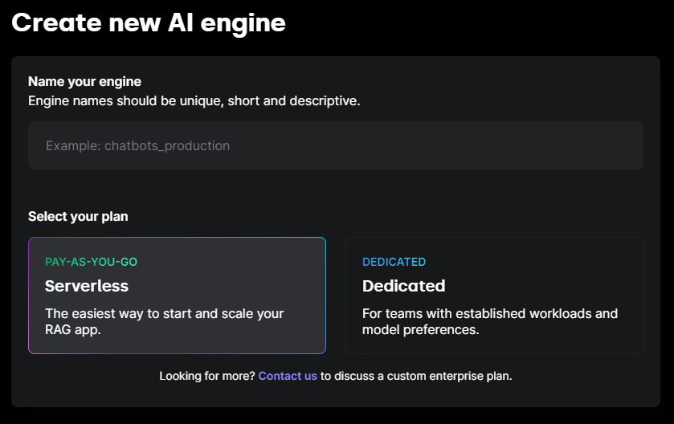
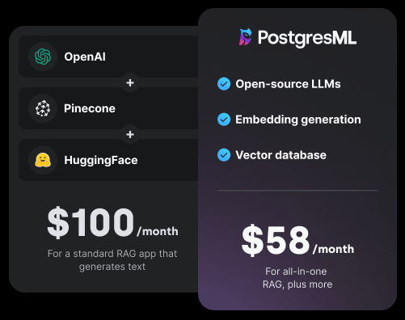

# Serverless LLMs are dead; Long live Serverless LLMs

<figure><figcaption></figcaption></figure>

Montana Low

May 30, 2024

PostgresML’s latest update brings best-in-class LLMs inside your GPU accelerated database, with 0 warmup latency. Instantly access hundreds of thousands of GPU processing cores, and terabytes of active GPU memory, on the same machine where your data is cached in main memory. Pay only for the compute and storage you use. This is the state of the art for interactive RAG applications with open-weight models like Meta’s Llama 3. It’s faster, safer, cheaper and more reliable than any other option.

## The challenge of serverless LLMs

LLMs are large by definition. Llama 3’s mid-range 70B model requires ~140GB just to load the weights in an efficient half precision (fp16) format. That requires at least 2 Nvidia A100 GPUs, which retails for ~$7,500/mo on major clouds like AWS, Azure & GCP. That is, if you can actually get access to them. If you want the latest generation Nvidia H100s to improve latency, then that much GPU RAM will cost you ~$22,500/mo, but you can’t rent H100s 2 at a time, you can only get them 8 at a time for ~$90,000/mo, on-demand pricing.

GPU RAM is in very high demand, which has driven up costs and reduced availability. Most applications do not sustain on the order of 100 concurrent interactive chatbot sessions, or 1000 embedding requests per second to make dedicated GPUs cost-effective. Even if they do generate that workload, they need to deliver significant financial benefits to be cost-effective.

### Serverless is not the answer
Serverless applications typically work because the application code required to execute requests is relatively small, and can be launched, cached and replicated relatively quickly. You can not load 140GB of model weights from disk into GPU RAM within the timespan of reasonable serverless request timeout. [Startups have tried, and failed](https://www.banana.dev/blog/sunset).

We tried this approach originally as well. Any model you used would be cached on your connection. After the first request warmed up the connection things were great, but that first request could time out – perpetually, never succeeding. Infinitely re-loading models for little if any actual usage is not a good use of scarce resources.

### Hosted service APIs are not the answer
If you can’t load models on-demand, and individual users can’t afford to pay for the RAM to leave the models resident long term, the next best thing is to share the cost of the models RAM between many users. APIs like OpenAI and Fireworks.ai achieve cost-effective hosting, because large numbers of users are sharing the weights across their aggregate requests, so they only need to pay for their portion of the compute used, rather than the RAM. If you only use a model for a fraction of the GPU capacity (hundreds of concurrent chats or thousands of embeddings per second), you only need to pay for a fraction of the cost. This is great.

That problem is that APIs do not live in your datacenter. They are managed by some other company.

- You are sending data to a 3rd party, which may violate privacy policies or compliance laws. They may be using your data to refine their models, either for their own private use, or to offer improvements to your competitors. This is the wild west, without much settled case law.
- You do not control model availability or update cadences. Models that your application depends on may be deprecated and dropped if there is insufficient utilization on their side. This will force you to constantly upgrade to whatever is trending, on their timetable.
- You have no control over how far away their datacenter is, and they operate with generalized transports like HTTP and JSON, rather than more efficient protocols used for low latency high bandwidth applications. _AI applications are relatively high bandwidth_. This makes APIs relatively high latency, often by an order of magnitude or two.
- Sending data over the open internet introduces additional reliability issues. Events relatively unrelated to you or even your provider will cause additional slowdowns and failures in your application.

### Dedicated hosting is not the answer (for most)
You may avoid many of the pitfalls of traditional Serverless deployments or APIs, but you’re back to paying full price for GPU RAM, so you’ll need to be operating at scale, with a large team to support this option. There are some additional pitfalls to hosting LLMs that many teams will re-discover, but they can be overcome.

- LLMs need to be either baked into the container (hundred GB container images break most existing CI/CD pipelines), or they need to be downloaded on startup (downloading hundreds of gigabytes at app boot has its own issues). You will put your k8s configuration and docker knowledge through its paces getting GPU hardware, drivers and compilers aligned.
- LLM dependencies change frequently like application code with each new model release, but in general the LLM service needs to be treated more like stateful databases where restarts are carefully coordinated with the application due to slow startup times, so control plane complexity will increase along with integration testing.
- Your infrastructure team will not enjoy managing the frequent dependency updates required to keep up with the state of the art models, especially when machine learning engineers need to experiment with these models in production. Real-world data is essential for understanding which models work best with your application's unique data characteristics. That’s where the differentiated value is.

Serving LLMs is the worst of both worlds compared to handling stateless or stateful infrastructure, and requires special care and feeding.

## In-database models are the answer

With this update to PostgresML’s serverless offering, we’re curating the best-in-class versions of open-weight models for our users, and making them available to all serverless databases in shared memory across multiple GPUs.

- Meta’s Llama 3 family, both 8B and 70B
- Mistral AI’s Mistral-7b and Mixtral-8x7B mixture of experts
- Microsoft’s Phi 3 with 128k context size

We’re also loading up task specific models, like Google’s Pegasus for efficient summarization, and embedding models that all exceed OpenAI’s latest iterations in terms of both quality and latency, from leading innovators like Alibaba, mixedbread.ai and intfloat.

Because we’ve curated the best in class models, they will always be instantly ready to run, giving the scale and cost advantages of an API, without any of the 3rd party or networking risks. This means you get the capabilities of multiple startups, all from a single provider, with a simple pricing model.

Your application can instantly burst usage to massive scale without a second thought, other than the aforementioned cost of GPU usage. Financial costs are now the limiting factor, but we have an additional new lever to optimize costs even further.

### Multi-tenant continuous batching
It’s not just loading the model weights into GPU RAM the first time that’s expensive. Streaming those weights from GPU RAM to the CUDA cores for each request is actually the bottleneck for most LLM applications. Continuous batching allows us to reuse a single layer of weights for multiple different queries at the same time, further reducing costs, without significantly impacting overall latency. Thanks to vLLM team for [this impressive breakthrough](https://arxiv.org/abs/2309.06180) in performance.

### Simplified pricing
Compared to using a host of services to provide comparable functionality, our pricing is significantly simpler. We charge for:

Storage: $0.25 per gigabyte per month. Including text, vector, JSON, binary and relational data formats as well as all index types.
Compute: $7.50 per hour for requests. Including LLM, embeddings, NLP & ML models, analytical, relational and vector ANN queries. Query time is measured per request, to the nanosecond.

No fixed costs. We’ll even give you $100 free credit to test this functionality with your own data. Check out our [pricing](/pricing) to estimate your own workload and compare to alternative architectures.

### Custom & fine-tuned models
There is a myriad number of specialized models available for use with PostgresML. We strive for compatibility with anything you can download from Hugging Face. You can also fine tune models using PostgresML, or upload your own variants with a private Hugging Face access key. These models are not shared, so they are billed based on the cost of the required GPU RAM to serve them, for as long as they are loaded for your engine.

This also gives you the option to avoid being forced into an undesirable update cadence. We take breaking changes seriously, including new model versions that have their own unpredictable behaviors, but also want to simplify long term management and the upgrade path when new model versions are inevitably released.

### Support is included
We’re here to help you optimize your workloads to get the most out of this architecture. In addition to support, we’ve built [an SDK](/docs/api/client-sdk/) that encapsulates core use cases like RAG that make it easy to get started building your own chat experience, with combined, LLM, embedding, ANN and keyword search all in one place. This is just the beginning.

### It’s easier than ever to get started
You can create and scale your AI engine in minutes. You no longer need to do any initial capacity planning, because you’ll have burst access to multiple GPUs whenever you need. We’ll autoscale both compute and storage as you use it. Just give it a name, and we’ll give you a connection string to get started building your AI application.

<figure><figcaption></figcaption></figure>

### Instant autoscaling
You’ll experience instant and near limitless scale, automatically. Our serverless plan dynamically adjusts to your application's needs, ensuring it can handle peak loads without the need for over provisioning. Whether you’re handling a sudden spike in traffic or scaling down during off-peak hours, we’ll adapt in real-time.

### Significant cost savings
<figure><figcaption>Try out our <a href="/pricing">cost calculator</a> to learn more about how we help you save</figcaption></figure>

Our new pricing is designed to minimize costs, you’ll save 42% on vector database costs alone if you’re using Pinecone. Additionally, you’ll only pay for what you use, with no up-front costs.

### Unmatched performance
Our serverless engines are not just about convenience; it's about performance too. When it comes to retrieval-augmented generation (RAG) chatbots, PostgresML is **4x faster than HuggingFace and Pinecone**. For embedding generation, we are **10x faster than OpenAI**. This means you can deliver faster, more responsive applications to your users.

### Dedicated instances available in every major cloud
In addition to pay as you go serverless usage, PostgresML also offers managed databases inside your Virtual Private Cloud in AWS, Azure and GCP. Enterprise customers operating at scale can have complete control and guaranteed data privacy. You’ll retain ultimate control of network security policies and hardware resources allocated. You can configure a private engine with as much scale and any models you need through our admin console, while using your own negotiated pricing agreements with the hosting cloud vendor.

## Get started with the AI infrastructure of the future today

LLMs are not the beginning, and they won't be the end of the journey. They are just one more example in a long chain of progress.

- In-database vector indexes are now obviously a better idea than standalone services, every database has one. The creators of FAISS, which largely popularized vector indexes, are now trying to build a whole new database to be competitive.
- In-database ML models offer significant advantages to microservice architectures. Most databases have some documented solutions now, even if it’s just User Defined Functions.
- In-database embedding models are now agreed to be a good idea, many databases are experimenting with at least wrapper services for convenience if not all the other benefits.
- In-database LLMs are the future, here now in PostgresML.

It’s not every paradigm that survives a decade of rapid evolution, and continuously comes out ahead of other implementations. As ML & AI applications find broader applications, more will realize: re-ranking models, dimensionality reduction, pruning, clustering, supervised learning, fine-tuning, quantizing, and much more standard ML functionality belongs in the database for production workloads.

_Moving models to the data, rather than continuously pulling data to the models_, will continue to be best, because it leverages the law of data gravity. [Try all of this today](/signup), and get $100 in free usage credits when you complete your workload profile.
You can also talk to our sales team, contact us for support, or post in our Discord with questions. If you experience something confusing, find a bug, or just have an idea on how to make PostgresML better, we’d love to hear from you. We always value your feedback.
