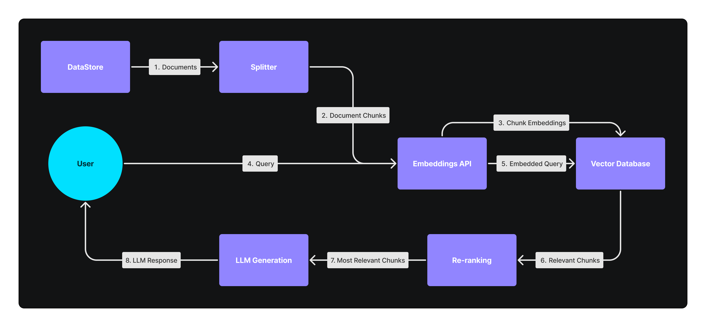

# Unified RAG

<div align="left">

<figure><figcaption></figcaption></figure>

</div>

Silas Marvin

June 12, 2024

## The pitfalls of typical RAG systems

The typical modern RAG workflow looks like this:

<figure><figcaption><p>Steps one through three prepare our RAG system, and steps four through eight are RAG itself.</p></figcaption></figure>

RAG systems have a number of drawbacks:
- They require multiple different paid services
- They introduce new microservices and points of failure
- They are slow and expose user data to third parties providing a negative user experience


## The solution: Unified RAG

Unified RAG is a solution to the drawbacks of RAG. Instead of relying on separate microservices to handle embedding, retrieval, reranking, and text generation, unified RAG combines them under one service. In this case, we will be combining them all under PostgresML.

### Preperation

Just like RAG, the first step is to prepare our unified RAG system, and the first step in preparing our Unified RAG system is storing our documents in our PostgresML Postgres database.

!!! generic

!!! code_block

```postgresql
CREATE TABLE documents (id SERIAL PRIMARY KEY, document text NOT NULL);

-- Insert a document that has some examples of pgml.transform
INSERT INTO documents (document) VALUES ('
Here is an example of the pgml.transform function

SELECT pgml.transform(
  task   => ''{
    "task": "text-generation",
    "model": "meta-llama/Meta-Llama-3.1-8B-Instruct"
  }''::JSONB,
  inputs  => ARRAY[''AI is going to''],
  args   => ''{
    "max_new_tokens": 100
  }''::JSONB
);

Here is another example of the pgml.transform function

SELECT pgml.transform(
  task   => ''{
    "task": "text-generation",
    "model": "meta-llama/Meta-Llama-3.1-70B-Instruct"
  }''::JSONB,
  inputs  => ARRAY[''AI is going to''],
  args   => ''{
    "max_new_tokens": 100
  }''::JSONB
);

Here is a third example of the pgml.transform function

SELECT pgml.transform(
  task   => ''{
    "task": "text-generation",
    "model": "microsoft/Phi-3-mini-128k-instruct"
  }''::JSONB,
  inputs  => ARRAY[''AI is going to''],
  args   => ''{
    "max_new_tokens": 100
  }''::JSONB
);
');

-- Also insert some random documents
INSERT INTO documents (document) SELECT md5(random()::text) FROM generate_series(1, 100);
```

!!!

!!!

In addition to the document that contains an example of `pgml.transform` we have inserted 100 randomly generated documents. We include these noisy documents to verify that our Unified RAG system can retrieve the correct context.

We can then split them using the `pgml.chunk` function.

!!! generic

!!! code_block

```postgresql
CREATE TABLE chunks(id SERIAL PRIMARY KEY, chunk text NOT NULL, chunk_index int NOT NULL, document_id int references documents(id));

INSERT INTO chunks (chunk, chunk_index, document_id)
SELECT
    (chunk).chunk,
    (chunk).chunk_index,
    id
FROM (
    SELECT
        pgml.chunk('recursive_character', document, '{"chunk_size": 250}') chunk,
        id
    FROM
        documents) sub_query;
```

!!!

!!!

!!! note

We are explicitly setting a really small chunk size as we want to split our example document into 6 chunks, 3 of which only have text and don't show the examples they are referring to so we can demonstrate reranking.

!!!

We can verify they were split correctly.

!!! generic

!!! code\_block

```postgresql
SELECT * FROM chunks limit 10;
```

!!!

!!! results

|  id  |                          chunk                                                                                                                                                                                                            |  chunk_index  |  document_id  |
| ---- | ----------------------------------------------------------------------------------------------------------------------------------------------------------------------------------------------------------------------------------------- | ------------- | ------------- |
|  1   |  Here is an example of the pgml.transform function                                                                                                                                                                                        |            1  |          1    |
|  2   |  SELECT pgml.transform(\n task   => ''{\n "task": "text-generation",\n "model": "meta-llama/Meta-Llama-3.1-8B-Instruct"\n }''::JSONB,\n inputs  => ARRAY[''AI is going to''],\n args   => ''{\n "max_new_tokens": 100\n }''::JSONB\n );     |            2  |          1    |
|  3   |  Here is another example of the pgml.transform function                                                                                                                                                                                   |            3  |          1    |
|  4   |  SELECT pgml.transform(\n task   => ''{\n "task": "text-generation",\n "model": "meta-llama/Meta-Llama-3.1-70B-Instruct"\n }''::JSONB,\n inputs  => ARRAY[''AI is going to''],\n args   => ''{\n "max_new_tokens": 100\n }''::JSONB\n );    |            4  |          1    |
|  5   |  Here is a third example of the pgml.transform function                                                                                                                                                                                   |            5  |          1    |
|  6   |  SELECT pgml.transform(\n task   => ''{\n "task": "text-generation",\n "model": "microsoft/Phi-3-mini-128k-instruct"\n }''::JSONB,\n inputs  => ARRAY[''AI is going to''],\n args   => ''{\n "max_new_tokens": 100\n }''::JSONB\n );      |            6  |          1    |
|  7   |  ae94d3413ae82367c3d0592a67302b25                                                                                                                                                                                                         |            1  |          2    |
|  8   |  34b901600979ed0138557680ff528aa5                                                                                                                                                                                                         |            1  |          3    |
|  9   |  ce71f8c6a6d697f4c4c9172c0691d646                                                                                                                                                                                                         |            1  |          4    |
|  10  |  f018a8fde18db014a1a71dd700118d89                                                                                                                                                                                                         |            1  |          5    |

!!!

!!!

Instead of using an embedding API, we are going to embed our chunks directly in our databse using the `pgml.embed` function.

!!! generic

!!! code_block

```postgresql
CREATE TABLE embeddings (
    id SERIAL PRIMARY KEY, chunk_id bigint, embedding vector (1024),
    FOREIGN KEY (chunk_id) REFERENCES chunks (id) ON DELETE CASCADE
);

INSERT INTO embeddings(chunk_id, embedding)
SELECT
    id,
    pgml.embed('mixedbread-ai/mxbai-embed-large-v1', chunk)
FROM
    chunks;
```

!!!

!!!

In this case we are using the `mixedbread-ai/mxbai-embed-large-v1` a SOTA model with incredible recall performance.

We can verify they were embedded correctly.

!!! generic

!!! code_block

```postgresql
\x auto
SELECT * FROM embeddings LIMIT 1;
\x off
```

!!!

!!! results

```text
id        | 1
chunk_id  | 1
embedding | [0.018623363,-0.02285168,0.030968409,-0.0008862989,-0.018534033,-0.025041971,0.013351363,0.030264968,0.018940015,0.040349673,0.048829854,0.015713623,0.021163238,-0.004478061,-0.0062974053,0.01342851,-0.020463197,-0.04097013,-0.030838259,-0.0026781335,-0.013514478,-0.017542545,-0.055083144,-0.061959717,-0.012871186,0.031224959,0.02112418,-0.014853348,0.055648107,0.08431109,-0.041937426,-0.02310592,0.02245858,-0.0431297,-0.008469138,-0.011226366,0.032495555,-0.020337906,-0.016152548,-0.023888526,0.02149491,-0.0053377654,0.0476396,-0.036587544,-0.07834923,0.015603419,0.043070674,0.019468445,-0.066474535,-0.0015779501,-0.013878166,-0.013458725,0.013851631,0.0071652774,-0.023882905,-0.015201843,0.012238541,-0.03737877,-0.025391884,0.043650895,0.01558388,0.039119314,0.029194985,-0.04744193,0.0056170537,0.010778638,-0.017884707,-0.00029244038,-0.012602758,-0.007875246,-0.04526054,-6.4284686e-05,-0.005769598,-0.00038845933,-0.032822825,0.03684274,-0.0008313914,-0.046097573,-0.014152655,0.04616714,-0.022156844,0.03566803,-0.014032094,0.009407709,-0.038648155,-0.024573283,0.0156378,0.0547954,0.035394646,0.0076721613,-0.007008655,0.032833662,-0.0011310929,-0.013156701,-0.0042242086,0.069960855,-0.021828847,0.02955284,-0.025502147,-0.009076977,0.05445286,0.08737233,-0.02128801,0.042810723,-0.0058011413,-0.0107959015,0.032310173,-0.010621498,-0.021176925,-0.021960221,-0.015585316,-0.007902493,0.034406897,-0.023450606,0.0037850286,0.04483244,-0.011478958,-0.031562425,-0.019675884,-0.008219446,-0.005607503,-0.03065768,0.0323341,-0.019487593,0.009064247,-0.038718406,0.0059558107,0.023667725,-0.035244368,9.467191e-05,0.0049183182,-0.037334662,-0.021340346,0.0019130141,0.019300135,-0.0029919841,-0.045514077,0.02666689,0.0046224073,-0.021685645,-0.0037645202,0.0006780366,-0.015406854,0.09090279,0.018704489,-0.02280434,0.05506764,-0.008431497,-0.037277948,0.03009002,-0.009108825,-0.00083089864,0.0048499256,0.0048382734,0.0094076255,-0.024700468,-0.016617157,0.008510655,-0.012369503,0.014046174,-0.010123938,-0.028991196,0.009815532,0.054396246,-0.029008204,0.04051117,-0.07013572,-0.03733185,-0.060128953,-0.024095867,0.0018222647,0.0018169725,-0.0009262719,-0.005803398,0.03986231,0.06270649,0.01694802,-0.008162654,0.004494133,0.038037747,-0.018806586,-0.011087607,0.026261529,0.052072495,0.016593924,0.0072109043,0.03479167,0.009446735,0.020005314,-0.027620671,0.018090751,0.04036098,-0.0027258266,0.016745605,-0.02886597,0.04071484,-0.06869631,0.001225516,-0.06299305,-0.0709894,-0.0192085,0.013239349,-0.021542944,0.001710626,-0.018116038,-0.01748119,0.01775824,0.03925247,-0.012190861,0.035636537,0.042466108,-0.016491935,-0.037154924,0.018040363,-0.0131627545,0.010722516,-0.026140723,0.02564186,-0.004605382,0.041173078,0.00073589047,0.011592239,0.009908486,0.043702055,0.053091794,-0.012142852,-0.00018352101,0.085855715,-0.014580144,0.029045325,-0.0023999067,0.025174063,0.044601757,0.035770934,0.040519748,0.037240535,0.043620642,0.044118866,0.019248607,0.011306996,0.020493535,0.035936765,0.048831582,0.012623841,0.009265478,0.010971202,-0.0132412,0.0109977005,-0.0054538464,0.016473738,-0.04083495,0.042505562,-0.001342487,0.005840936,0.0017675279,0.017308434,0.0420143,0.051328707,-0.009452692,0.0057223514,0.026780825,0.00742446,-0.024630526,0.03107323,0.00916192,0.027411995,-0.0019175496,-0.025291001,-0.01901041,-0.07651367,-0.0465344,-0.042462647,-0.024365354,-0.021079501,-0.0432224,0.00013768316,0.00036046258,-0.03718051,0.038763855,0.0032811756,0.00697624,-0.017028604,-0.048220832,0.012214309,0.03986564,0.003932904,-0.042311475,0.005391691,0.028816152,0.069943205,-0.055599026,-0.010274334,0.028868295,0.00585409,0.009760283,0.0118976,-0.040581644,-0.053004548,-0.0526296,-0.034240413,-0.0038363612,-0.004730754,-0.018723277,-0.01601637,-0.038638163,0.06655874,0.0351013,-0.004038268,0.040204167,0.040881433,-0.04239331,-0.010466879,0.009326172,0.00036304537,-0.056721557,0.03998027,0.02481976,-0.004078023,0.0029230101,-0.019404871,-0.005828477,0.04294278,-0.017550338,-0.007534357,-0.008580863,0.056146596,0.007770364,-0.03207084,0.017874546,0.004025578,-0.047864694,-0.034685463,-0.033363935,0.02950657,0.05429194,0.0073523414,-0.014066911,0.02366431,0.03610486,0.032978192,0.016071666,-0.035677373,0.0054646228,0.0203664,0.019233122,0.058928937,0.0041354564,-0.02027497,0.00040053058,0.0019034429,-0.012043072,0.0017847657,0.03676109,0.047565766,-0.005874584,0.017794278,-0.030046426,-0.021112567,0.0056568286,0.01376357,0.05977862,0.011873086,-0.028216759,-0.06745307,-0.016887149,-0.04243197,-0.021764198,0.047688756,0.023734126,-0.04353192,0.021475876,0.01892414,-0.017509887,0.0032162662,-0.009358749,-0.03721738,0.047566965,-0.017878285,0.042617068,-0.027871821,-0.04227529,0.003985077,-0.019497044,0.0072685108,0.021165995,0.045710433,0.0059271595,-0.006183208,-0.032289572,-0.044465903,-0.020464543,0.0033873026,0.022058886,-0.02369358,-0.054754533,0.0071472377,0.0021873175,0.04660187,0.051053047,-0.010261539,-0.009315611,0.02052967,0.009023642,0.031200182,-0.040883888,0.016621651,-0.038626544,0.013732269,0.010218355,0.019598525,-0.006492417,-0.012904362,-0.010913204,0.024882413,0.026525095,0.008932081,-0.016051447,0.037517436,0.053253606,0.035980936,-0.0074353246,-0.017852481,-0.009176863,0.026370667,0.03406368,-0.036369573,-0.0033056326,-0.039790567,-0.0010809397,0.06398017,-0.0233756,-0.022745207,0.0041284347,-0.006868821,-0.022491742,0.029775932,0.050810635,-0.011080408,-0.007292075,-0.078457326,0.0044635567,0.012759795,-0.015698882,-0.02220119,0.00942075,-0.014544812,0.026497401,0.01487379,-0.005634491,-0.025069563,0.018097453,-0.029922431,0.06136796,-0.060082547,0.01085696,-0.039873533,-0.023137532,-0.01009546,0.005100517,-0.029780779,-0.018876795,0.0013024161,-0.0027637074,-0.05871409,-0.04807621,0.033885162,-0.0048714406,-0.023327459,0.024403112,-0.03556512,-0.022570046,0.025841955,0.016745063,0.01596773,-0.018458387,-0.038628712,0.012267835,0.013733216,-0.05570125,0.023331221,-0.010143926,0.0030010103,-0.04085697,-0.04617182,0.009094808,-0.057054907,-0.045473132,0.010000442,-0.011206348,-0.03056877,0.02560045,-0.009973477,0.042476565,-0.0801304,0.03246869,-0.038539965,-0.010913026,-0.022911731,0.030005522,-0.010367593,0.026667004,-0.027558804,-0.05233932,0.009694177,0.0073628323,0.015929429,-0.026884604,0.016071552,-0.00019720798,0.00052713073,-0.028247854,-0.028402891,-0.016789969,-0.024457792,-0.0025927501,0.011493104,0.029336551,-0.035506643,-0.03293709,0.06718526,0.032991756,-0.061416663,-0.034664486,0.028762456,-0.015881855,-0.0012977219,0.017649014,0.013985521,-0.03500709,-0.06555898,0.01739066,-0.045807093,0.004867656,-0.049182948,-0.028917754,0.0113239065,0.013335351,0.055981997,-0.036910992,-0.018820828,-0.043516353,0.008788547,-0.05666949,0.009573692,-0.021700945,0.010256802,-0.017312856,0.044344205,-0.0076902485,-0.008851547,0.0010788938,0.011200733,0.034334365,0.022364784,-0.030579677,-0.03471,-0.011425675,-0.011280336,0.020478066,-0.007686596,-0.022225162,0.028765464,-0.016065672,0.037145622,-0.009211553,0.007401809,-0.04353853,-0.04326396,-0.011851935,-0.03837259,-0.024392553,-0.056246143,0.043768484,-0.0021168136,-0.0066281,-0.006896298,-0.014978161,-0.041984025,-0.07014386,0.042733505,-0.030345151,-0.028227473,-0.029198963,-0.019491067,0.036128435,0.006671823,0.03273865,0.10413083,0.046565324,0.03476281,-0.021236487,0.010281997,0.008132755,-0.006925993,0.0037259492,-0.00085186976,-0.063399576,-0.031152688,-0.026266094,-0.039713737,-0.017881637,-0.004793995,0.044549145,-0.019131236,0.041359022,-0.020011334,-0.0487966,-0.012533663,0.009177706,0.056267086,0.004863351,0.029361043,-0.017181171,0.05994776,0.024275357,-0.026009355,-0.037247155,-0.00069368834,0.049283065,0.00031620747,-0.05058156,0.038948,0.0038390015,-0.04601819,-0.018070936,0.006863339,-0.024927856,-0.0056363824,-0.05078538,-0.0061668083,0.009082598,-0.007671819,0.043758992,0.02404526,-0.02915477,0.015156649,0.03255342,-0.029333884,-0.030988852,0.0285258,0.038548548,-0.021007381,-0.004295833,-0.004408545,-0.015797473,0.03404609,0.015294826,0.043694574,0.064626984,0.023716459,0.02087564,0.028617894,0.05740349,0.040547665,-0.020582093,0.0074607623,0.007739327,-0.065488316,-0.0101815825,-0.001488302,0.05273952,0.035568725,-0.013645145,0.00071412086,0.05593781,0.021648252,-0.022956904,-0.039080553,0.019539805,-0.07495989,-0.0033871594,-0.007018141,-0.010935482,-5.7075984e-05,0.013419309,-0.003545881,-0.022760011,0.00988566,0.014339391,-0.008118722,0.056001987,-0.020148695,0.0015329354,-0.024960503,-0.029633753,-0.013379987,-0.0025359367,0.013124176,0.031880926,-0.01562599,0.030065667,0.0014069993,0.0072038868,0.014385158,-0.009696549,-0.014109655,-0.059258915,-0.0002165593,0.016604712,-0.0059224735,-0.0013092262,-0.00022250676,-0.0023060953,-0.014856572,-0.009526227,-0.030465033,-0.039493423,-0.0011756015,0.033197496,-0.028803488,0.011914758,-0.030594831,-0.008639591,-0.020312231,0.026512157,0.015287617,0.0032433916,0.0074692816,0.0066296835,0.030222693,0.025374962,0.027766889,-0.017209511,-0.032084063,-0.020027842,0.008249133,-0.005054688,0.051436525,-0.030558063,-0.02633653,-0.01538074,0.010943056,0.0036713344,0.0024809965,0.006587549,-0.007795616,-0.051794346,-0.019547012,-0.011581287,-0.007759964,0.045571648,-0.009941077,-0.055039328,0.0055089286,-0.025752712,-0.011321939,0.0015637486,-0.06359818,-0.034881815,0.01625671,-0.013557044,0.039825413,-0.0027895744,-0.014577813,-0.0008740217,0.0034209616,0.043508507,-0.023725279,0.012181109,-0.009782305,0.0018773589,-0.065146625,0.009437339,0.00733527,0.049834568,-0.020543063,-0.039150853,-0.015234995,-0.006770511,0.002985214,-0.0011479045,0.009379375,-0.011452433,-0.0277739,0.014886782,-0.0065106237,0.006157106,-0.009041895,0.0031169152,-0.0669943,0.0058886297,-0.056187652,0.011594736,0.018308813,-0.026984183,-0.021653237,0.081568025,0.02491183,0.0063725654,0.028600894,0.04295813,0.019567039,-0.015854416,-0.07523876,0.012444418,0.02459371,0.054541484,-0.0017476659,-0.023083968,0.010912003,0.01662412,0.033263847,-0.022505535,0.016509151,0.019118164,0.026604444,-0.01345531,-0.034896314,-0.030420221,-0.005380027,0.009990224,0.063245244,-0.02383651,-0.031892184,-0.019316372,-0.016938515,0.040447593,-0.0030380695,-0.035975304,0.011557656,0.0014175953,0.0033523554,0.019000882,-0.009868413,0.025040675,0.0313598,0.020148544,0.025335543,-0.0030205864,0.0033406885,0.015278818,-0.008082225,-0.013311091,0.0024015747,0.02845818,-0.024585644,-0.0633492,-0.07347503,-0.008628047,-0.044017814,-0.010691597,0.03241164,0.0060925046,-0.032058343,-0.041429296,0.06868553,0.011523587,0.05747461,0.043150447,-0.035121176,-0.0052461633,0.04020538,0.021331007,0.02410664,-0.021407101,0.08082899,0.025684848,0.06999515,0.02202676,-0.025417957,-0.0094303815,0.028135775,-0.019147158,-0.04165579,-0.029573435,-0.0066949194,0.006705128,-0.015028007,-0.037273537,-0.0018824468,0.017890878,-0.0038961077,-0.045805767,0.0017864663,0.057283465,-0.06149215,0.014828884,0.016780626,0.03504063,0.012826686,0.01825945,-0.014611099,-0.05054207,0.0059569273,-0.050427742,0.012945258,-0.000114398965,0.02219763,-0.022247856,-0.029176414,-0.020923832,-0.025116103,-0.0077409917,-0.016431509,0.02489512,0.04602958,0.03150148,0.012386089,-0.05198216,-0.0030460325,0.0268005,0.038448498,0.01924401,0.07118071,0.036725424,-0.013376856,-0.0049849628,-0.03859098,0.03737393,-0.0052245436,-0.006352251,0.019535184,-0.0017854937,-0.0153605975,-0.067677096,0.0035186394,0.072521344,-0.031051565,-0.016579162,-0.035821736,0.0012950175,-0.04756073,-0.037519347,-0.044505138,0.03384531,0.016431695,0.01076104,0.01761071,-0.030177226,0.20769434,0.044621687,0.025764097,-0.00054298044,0.029406168,0.053361185,0.013022782,-0.006139999,0.001014758,-0.051892612,0.023887891,0.0035872294,0.008639285,0.010232208,-0.021343045,0.017568272,-0.07338228,0.014043151,-0.015673313,-0.04877262,-0.04944962,0.05635428,0.0064074355,0.042409293,0.017486382,0.026187604,0.052255314,-0.039807603,-0.03299426,-0.04731727,-0.034517273,0.00047638942,0.008196412,0.020099401,-0.007953495,0.005094485,-0.032003388,-0.033158697,-0.020399494,0.015141361,0.026477406,-0.01990327,0.021339003,-0.043441944,-0.01901073,0.021291636,-0.039682653,0.039700523,0.012196781,-0.025805188,0.028795147,-0.027478887,0.022309775,-0.09748059,-0.014054129,0.0018843628,0.014869343,-0.019351315,0.0026920864,0.03932672,-0.0066732406,0.035402156,0.0051303576,0.01524948,-0.010795729,0.063722104,-0.0139351925,0.016053425,-0.042903405,-0.008158309,-0.025266778,-0.025320085,0.051727448,-0.046809513,0.020976106,0.032922912,-0.018999893,0.009321827,0.0026644706,-0.034224827,0.007180524,-0.011403546,0.00018723078,0.020122612,0.0053222817,0.038247555,-0.04966653,1.7162782e-05,0.028443096,0.056440514,0.037390858,0.050378226,-0.03398227,0.029389588,-0.01307477]
```

!!!

!!!

Notice that we set expanded display to auto to make it easier to visualize the output.

### Unified Retrieval

Retrieval with Unified RAG is lightning fast and incredibly simple. 

!!! generic

!!! code_block time="32.823 ms"

```postgresql
WITH embedded_query AS (
    SELECT
        pgml.embed('mixedbread-ai/mxbai-embed-large-v1', 'How do I write a select statement with pgml.transform?', '{"prompt": "Represent this sentence for searching relevant passages: "}')::vector embedding
)
SELECT
    chunks.id,
    (
        SELECT
            embedding
        FROM embedded_query) <=> embeddings.embedding cosine_distance,
    chunks.chunk
FROM
    chunks
    INNER JOIN embeddings ON embeddings.chunk_id = chunks.id
ORDER BY
    embeddings.embedding <=> (
        SELECT
            embedding
        FROM embedded_query)
LIMIT 6;
```

!!!

!!! results

| id  |    cosine_distance    |                          chunk                                                                                                                                                                                                                                         |
| --- | --------------------- | ---------------------------------------------------------------------------------------------------------------------------------------------------------------------------------------------------------------------------------------------------------------------- |
|  1  |  0.09044166306461232  |  Here is an example of the pgml.transform function                                                                                                                                                                                                                     |
|  3  |  0.10787954026965096  |  Here is another example of the pgml.transform function                                                                                                                                                                                                                |
|  5  |  0.11683694289239333  |  Here is a third example of the pgml.transform function                                                                                                                                                                                                                |
|  2  |  0.17699128851412282  |  SELECT pgml.transform(\n task   => ''{\n "task": "text-generation",\n "model": "meta-llama/Meta-Llama-3.1-8B-Instruct"\n }''::JSONB,\n inputs  => ARRAY[''AI is going to''],\n args   => ''{\n "max_new_tokens": 100\n }''::JSONB\n );                                  |
|  4  |  0.17844729798760672  |  SELECT pgml.transform(\n task   => ''{\n "task": "text-generation",\n "model": "meta-llama/Meta-Llama-3.1-70B-Instruct"\n }''::JSONB,\n inputs  => ARRAY[''AI is going to''],\n args   => ''{\n "max_new_tokens": 100\n }''::JSONB\n );                                 |
|  6  |  0.17520464423854842  |  SELECT pgml.transform(\n task   => ''{\n "task": "text-generation",\n "model": "microsoft/Phi-3-mini-128k-instruct"\n }''::JSONB,\n inputs  => ARRAY[''AI is going to''],\n args   => ''{\n "max_new_tokens": 100\n }''::JSONB\n );                                   |

!!!

!!!

We are using a CTE to embed the user query, and then performing nearest neighbors search using the cosine similarity function to compare the distance between our embeddings. Note how fast this is! We are embedding the query in the database and utilizing an HNSW index from pgvector to perform ridiculously fast retrieval.

There is a slight problem with the results of our retrieval. If you were to ask me: `How do I write a select statement with pgml.transform?` I couldn't use any of the top 3 results from our search to answer that queestion. Our search results aren't bad, but they can be better. This is why we rerank.

### Unified Retrieval + Reranking

We can rerank in the database in the same query we did retrieval with using the `pgml.rank` function.

!!! generic

!!! code_block time="63.702 ms"

```postgresql
WITH embedded_query AS (
    SELECT
        pgml.embed('mixedbread-ai/mxbai-embed-large-v1', 'How do I write a select statement with pgml.transform?', '{"prompt": "Represent this sentence for searching relevant passages: "}')::vector embedding
),
vector_search AS (
    SELECT
      chunks.id,
      (
          SELECT
              embedding
          FROM embedded_query) <=> embeddings.embedding cosine_distance,
      chunks.chunk
  FROM
      chunks
  INNER JOIN embeddings ON embeddings.chunk_id = chunks.id
  ORDER BY
      embeddings.embedding <=> (
          SELECT
              embedding
          FROM embedded_query)
  LIMIT 6
),
row_number_vector_search AS (
    SELECT
        cosine_distance,
        chunk,
        ROW_NUMBER() OVER () AS row_number
    FROM
        vector_search
)
SELECT
    cosine_distance,
    (rank).score AS rank_score,
    chunk
FROM (
    SELECT
      cosine_distance,
      rank,
      chunk
    FROM
        row_number_vector_search AS rnsv1
    INNER JOIN (
        SELECT
          pgml.rank('mixedbread-ai/mxbai-rerank-base-v1', 'How do I write a select statement with pgml.transform?', array_agg("chunk"), '{"return_documents": false, "top_k": 6}'::jsonb || '{}') AS rank
        FROM
          row_number_vector_search
    ) AS rnsv2 ON (rank).corpus_id + 1 = rnsv1.row_number
) AS sub_query;
```

!!!

!!! results

|    cosine_distance   |      rank_score      |                         chunk                                                                                                                                                                                                         |
| -------------------- | -------------------- | ------------------------------------------------------------------------------------------------------------------------------------------------------------------------------------------------------------------------------------- | 
|   0.2124727254737595 |   0.3427378833293915 | SELECT pgml.transform(\n task   => ''{\n "task": "text-generation",\n "model": "meta-llama/Meta-Llama-3.1-70B-Instruct"\n }''::JSONB,\n inputs  => ARRAY[''AI is going to''],\n args   => ''{\n "max_new_tokens": 100\n }''::JSONB\n ); |
|   0.2109014406365579 |    0.342184841632843 | SELECT pgml.transform(\n task   => ''{\n "task": "text-generation",\n "model": "meta-llama/Meta-Llama-3.1-8B-Instruct"\n }''::JSONB,\n inputs  => ARRAY[''AI is going to''],\n args   => ''{\n "max_new_tokens": 100\n }''::JSONB\n );  |
|  0.21259646694819168 |   0.3332781493663788 | SELECT pgml.transform(\n task   => ''{\n "task": "text-generation",\n "model": "microsoft/Phi-3-mini-128k-instruct"\n }''::JSONB,\n inputs  => ARRAY[''AI is going to''],\n args   => ''{\n "max_new_tokens": 100\n }''::JSONB\n );   |
|  0.19483324929456136 |  0.03163915500044823 | Here is an example of the pgml.transform function                                                                                                                                                                                     |
|   0.1685870257610742 | 0.031176624819636345 | Here is a third example of the pgml.transform function                                                                                                                                                                                |
|   0.1834613039099552 | 0.028772158548235893 | Here is another example of the pgml.transform function                                                                                                                                                                                |

!!!

!!!


We are using the `mixedbread-ai/mxbai-rerank-base-v1` model to rerank the results from our semantic search. Once again, note how fast this is. We have now combined the embedding api call, the semantic search api call, and the rerank api call from our RAG flow into one sql query with embedding generation, retrieval and reranking all happening in the database.

Also notice that the top 3 results all show examples using the `pgml.transform` function. This is the exact results we wanted for our search, and why we needed to rerank. 

### Unified Retrieval + Reranking + Text Generation

Using the pgml.transform function, we can perform text generation in the same query we did retrieval and reranking with.

!!! generic

!!! code_block time="1496.823 ms"

```postgresql
WITH embedded_query AS (
    SELECT
        pgml.embed('mixedbread-ai/mxbai-embed-large-v1', 'How do I write a select statement with pgml.transform?', '{"prompt": "Represent this sentence for searching relevant passages: "}')::vector embedding
),
vector_search AS (
    SELECT
      chunks.id,
      (
          SELECT
              embedding
          FROM embedded_query) <=> embeddings.embedding cosine_distance,
      chunks.chunk
  FROM
      chunks
  INNER JOIN embeddings ON embeddings.chunk_id = chunks.id
  ORDER BY
      embeddings.embedding <=> (
          SELECT
              embedding
          FROM embedded_query)
  LIMIT 6
),
row_number_vector_search AS (
    SELECT
        cosine_distance,
        chunk,
        ROW_NUMBER() OVER () AS row_number
    FROM
        vector_search
),
context AS (
  SELECT
      chunk
  FROM (
      SELECT
        chunk
      FROM
          row_number_vector_search AS rnsv1
      INNER JOIN (
          SELECT
            pgml.rank('mixedbread-ai/mxbai-rerank-base-v1', 'How do I write a select statement with pgml.transform?', array_agg("chunk"), '{"return_documents": false, "top_k": 1}'::jsonb || '{}') AS rank
          FROM
            row_number_vector_search
      ) AS rnsv2 ON (rank).corpus_id + 1 = rnsv1.row_number
  ) AS sub_query
)
SELECT
    pgml.transform (
      task => '{
        "task": "conversational",
        "model": "meta-llama/Meta-Llama-3-8B-Instruct"
      }'::jsonb, 
      inputs => ARRAY['{"role": "system", "content": "You are a friendly and helpful chatbot."}'::jsonb, jsonb_build_object('role', 'user', 'content', replace('Given the context answer the following question: How do I write a select statement with pgml.transform? Context:\n\n{CONTEXT}', '{CONTEXT}', chunk))], 
      args => '{
        "max_new_tokens": 100
      }'::jsonb)
FROM
    context;
```

!!!

!!! results

```text
["To write a SELECT statement with pgml.transform, you can use the following syntax:\n\n```sql\nSELECT pgml.transform(\n  task   => '{\n    \"task\": \"text-generation\",\n    \"model\": \"meta-llama/Meta-Llama-3-70B-Instruct\"\n  }'::JSONB,\n  inputs  => ARRAY['AI is going to'],\n  args   => '{\n    \"max_new_tokens\": 100\n  }'::JSONB\n"]
```

!!!

!!!

We have now combined the embedding api call, the semantic search api call, the rerank api call and the text generation api call from our RAG flow into one sql query.

We are using `meta-llama/Meta-Llama-3-8B-Instruct` to perform text generation. We have a number of different models available for text generation, but for our use case `meta-llama/Meta-Llama-3-8B-Instruct` is a fantastic mix between speed and capability. For this simple example we are only passing the top search result as context to the LLM. In real world use cases, you will want to pass more results.

We can stream from the database by using the `pgml.transform_stream` function and cursors. Here is a query measuring time to first token.

!!! generic

!!! code_block time="100.117 ms"

```postgresql
BEGIN;
DECLARE c CURSOR FOR WITH embedded_query AS (
    SELECT
        pgml.embed('mixedbread-ai/mxbai-embed-large-v1', 'How do I write a select statement with pgml.transform?', '{"prompt": "Represent this sentence for searching relevant passages: "}')::vector embedding
),
vector_search AS (
    SELECT
      chunks.id,
      (
          SELECT
              embedding
          FROM embedded_query) <=> embeddings.embedding cosine_distance,
      chunks.chunk
  FROM
      chunks
  INNER JOIN embeddings ON embeddings.chunk_id = chunks.id
  ORDER BY
      embeddings.embedding <=> (
          SELECT
              embedding
          FROM embedded_query)
  LIMIT 6
),
row_number_vector_search AS (
    SELECT
        cosine_distance,
        chunk,
        ROW_NUMBER() OVER () AS row_number
    FROM
        vector_search
),
context AS (
  SELECT
      chunk
  FROM (
      SELECT
        chunk
      FROM
          row_number_vector_search AS rnsv1
      INNER JOIN (
          SELECT
            pgml.rank('mixedbread-ai/mxbai-rerank-base-v1', 'How do I write a select statement with pgml.transform?', array_agg("chunk"), '{"return_documents": false, "top_k": 1}'::jsonb || '{}') AS rank
          FROM
            row_number_vector_search
      ) AS rnsv2 ON (rank).corpus_id + 1 = rnsv1.row_number
  ) AS sub_query
)
SELECT
    pgml.transform_stream(
      task => '{
        "task": "conversational",
        "model": "meta-llama/Meta-Llama-3-8B-Instruct"
      }'::jsonb, 
      inputs => ARRAY['{"role": "system", "content": "You are a friendly and helpful chatbot."}'::jsonb, jsonb_build_object('role', 'user', 'content', replace('Given the context answer the following question: How do I write a select statement with pgml.transform? Context:\n\n{CONTEXT}', '{CONTEXT}', chunk))], 
      args => '{
        "max_new_tokens": 100
      }'::jsonb)
FROM
    context;
FETCH 2 FROM c;
END;
```

!!!

!!! results

```text
BEGIN
Time: 0.175 ms

DECLARE CURSOR
Time: 31.498 ms

 transform_stream 
------------------
 []
 ["To"]
(2 rows)

Time: 68.204 ms

COMMIT
Time: 0.240 ms
```

!!!

!!!

Note how fast this is! With unified RAG we can perform the entire RAG pipeline and get the first token for our text generation back in 100 milliseconds.

In summary, we have reduced our RAG system that involved four different network calls into a single unified system that requires one sql query and yields a response in 100 milliseconds. Note that timing will vary with network latency.

Feel free to give Unified RAG on PostgresML a try and let us know what you think. If you have any questions, or just have an idea on how to make PostgresML better, we'd love to hear form you in our [Discord](https://discord.com/invite/DmyJP3qJ7U). We’re open source, and welcome contributions from the community, especially when it comes to the rapidly evolving ML/AI landscape.
