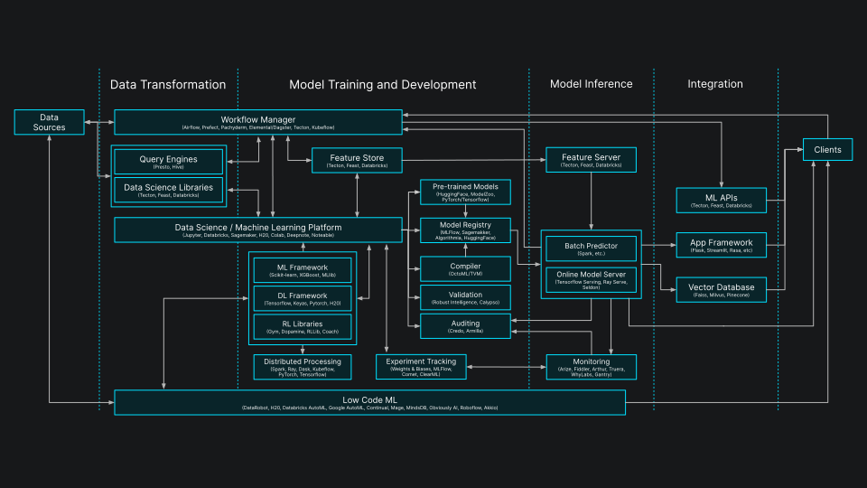

# Overview

PostgresML is a complete MLOps platform built inside PostgreSQL. Our operating principle is:

> _Move models to the database, rather than constantly moving data to the models._

Data for ML & AI systems is inherently larger and more dynamic than the models. It's more efficient, manageable and reliable to move models to the database, rather than continuously moving data to the models.

## AI engine

PostgresML allows you to take advantage of the fundamental relationship between data and models, by extending the database with the following capabilities:

* **Model Serving** - GPU accelerated inference engine for interactive applications, with no additional networking latency or reliability costs
* **Model Store** - Access to open-source models including state of the art LLMs from Hugging Face, and track changes in performance between versions
* **Model Training** - Train models with your application data using more than 50 algorithms for regression, classification or clustering tasks; fine tune pre-trained models like Llama and BERT to improve performance
* **Feature Store** - Scalable access to model inputs, including vector, text, categorical, and numeric data: vector database, text search, knowledge graph and application data all in one low-latency system

<figure><figcaption class="mt-2">
PostgresML handles all of the functions <a href="https://a16z.com/emerging-architectures-for-modern-data-infrastructure/">described by a16z</a>
</figcaption></figure>

These capabilities are primarily provided by two open-source software projects, that may be used independently, but are designed to be used together with the rest of the Postgres ecosystem:

* [**pgml**](/docs/open-source/pgml/) - an open source extension for PostgreSQL. It adds support for GPUs and the latest ML & AI algorithms _inside_ the database with a SQL API and no additional infrastructure, networking latency, or reliability costs.
* [**PgCat**](/docs/open-source/pgcat/) - an open source connection pooler for PostgreSQL. It abstracts the scalability and reliability concerns of managing a distributed cluster of Postgres databases. Client applications connect only to the pooler, which handles load balancing, sharding, and failover, outside of any single database server.

<figure><figcaption></figcaption></figure>

## Client SDK

The PostgresML team also provides [native language SDKs](/docs/open-source/korvus/) which implement best practices for common ML & AI applications. The JavaScript and Python SDKs are generated from the a core Rust library, which provides a uniform API, correctness and efficiency across all environments.

While using the SDK is completely optional, SDK clients can perform advanced machine learning tasks in a single SQL request, without having to transfer additional data, models, hardware or dependencies to the client application.

Some of the use cases include:

* Chat with streaming responses from state-of-the-art open source LLMs
* Semantic search with keywords and embeddings
* RAG in a single request without using any third-party services
* Text translation between hundreds of languages
* Text summarization to distill complex documents
* Forecasting time series data for key metrics with and metadata
* Anomaly detection using application data

## Our mission

PostgresML strives to provide access to open source AI for everyone. We are continuously developing PostgresML to keep up with the rapidly evolving use cases for ML & AI, but we remain committed to never breaking user facing APIs. We welcome contributions to our [open source code and documentation](https://github.com/postgresml) from the community.

## Managed cloud

While our extension and pooler are open source, we also offer a managed cloud database service for production deployments of PostgresML. You can [sign up](https://postgresml.org/signup) for an account and get a free Serverless database in seconds.
