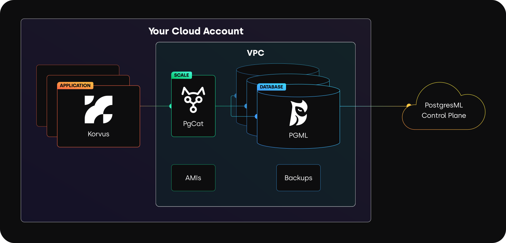

# VPC

PostgresML can be launched in your Virtual Private Cloud (VPC) account on AWS, Azure or GCP.

<figure><figcaption><p>Deploy in your cloud</p></figcaption></figure>

The PostgresML control plane provides a complete management solution to control the resources in your cloud account:
- Responsible for PostgresML instance launches, backups, monitoring and failover operations. This requires permission to create and destroy AWS EC2, EBS and AMI resources inside the designated VPC.
- Does not read/write any data inside PostgresML databases other than status metadata inside system tables or the pgml schema necessary to perform the previously mentioned operations.

## Creating an AWS role for VPC

To launch a VPC in AWS you must have a user with the correct permissions.

1. Sign in to the AWS Management Console and open the IAM console.
2. In the navigation pane, choose "Roles" and then "Create role".
3. Select "AWS account" as the trusted entity type, and choose "This account".
4. Click "Next" to proceed to permissions.
5. Click "Create policy" and switch to the JSON tab.
6. Paste the following policy document:
   ```json
   {
     "Version": "2012-10-17",
     "Statement": [
       {
         "Effect": "Allow",
         "Action": [
           "ec2:RunInstances",
           "ec2:TerminateInstances",
           "ec2:ModifyInstanceAttribute",
           "ec2:DescribeSecurityGroups",
           "ec2:CreateSecurityGroup",
           "ec2:AuthorizeSecurityGroupIngress",
           "ec2:AuthorizeSecurityGroupEgress",
           "ec2:DescribeInstances",
           "ec2:DescribeVolumes",
           "ec2:CreateTags",
           "ec2:DescribeVpcs",
           "ec2:DescribeSubnets",
           "ec2:CreateVolume",
           "ec2:DeleteVolume",
           "ec2:AttachVolume",
           "ec2:DetachVolume",
           "ec2:ModifyVolume",
           "imagebuilder:CreateImage",
           "imagebuilder:CreateImagePipeline",
           "iam:SimulatePrincipalPolicy",
           "iam:PassRole",
           "iam:GetRole",
           "iam:ListRoles",
           "iam:CreateRole",
           "iam:CreateInstanceProfile",
           "iam:AddRoleToInstanceProfile",
           "s3:CreateBucket",
           "s3:DeleteBucket",
           "s3:PutBucketPolicy",
           "s3:ListBucket",
           "s3:GetBucketPolicy",
           "s3:GetObject",
           "s3:PutObject",
           "s3:DeleteObject",
           "s3:ListBucketMultipartUploads",
           "s3:ListMultipartUploadParts",
           "s3:AbortMultipartUpload",
           "s3:GetBucketLocation",
           "s3:GetBucketTagging",
           "s3:PutBucketTagging",
           "kms:DescribeKey",
           "kms:CreateGrant",
           "kms:Decrypt",
           "kms:ReEncryptFrom",
           "kms:ReEncryptTo",
           "kms:GenerateDataKey",
           "kms:GenerateDataKeyPair",
           "kms:GenerateDataKeyPairWithoutPlaintext",
           "kms:GenerateDataKeyWithoutPlaintext"
         ],
         "Resource": "*"
       }
     ]
   }
   ```
7. Review and create the policy, giving it a descriptive name like "VPCSetupPolicy".
8. Back in the role creation process, attach this newly created policy to the role.
9. Name the role (e.g., "VPCSetupRole") and create it.
10. Go to the IAM Users section, select your user, and attach the created role.
11. Generate new access keys for this user if you haven't already.

