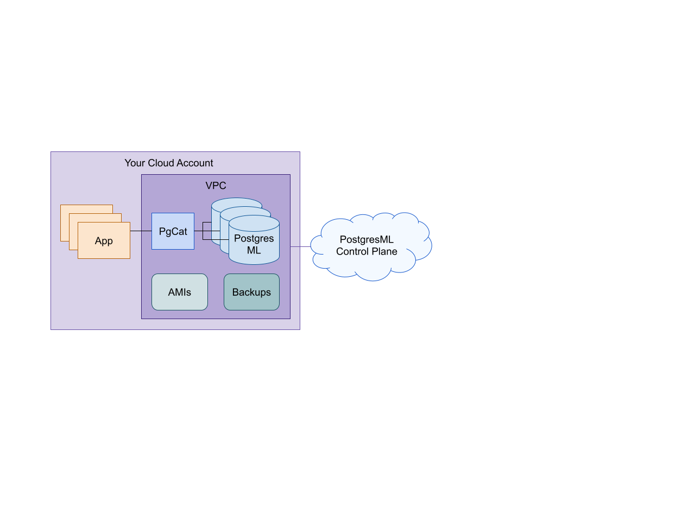

# VPC

PostgresML can be launched in your Virtual Private Cloud (VPC) account on AWS, Azure or GCP.

<figure><figcaption>
Deploy in your cloud
</figcaption></figure>

The PostgresML control plane provides a complete management solution to control the resources in your cloud account:
- Responsible for PostgresML instance launches, backups, monitoring and failover operations. This requires permission to create and destroy AWS EC2, EBS and AMI resources inside the designated VPC.
- Does not read/write any data inside PostgresML databases other than status metadata inside system tables or the pgml schema necessary to perform the previously mentioned operations.
