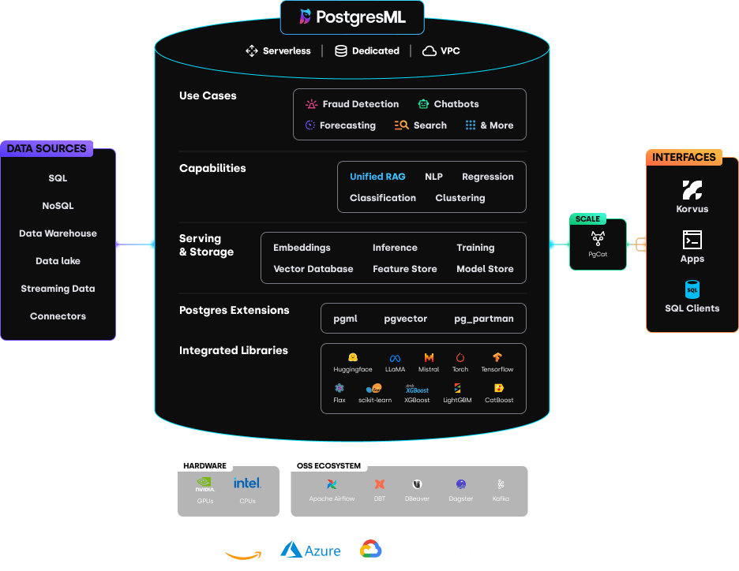

# Getting started

A PostgresML deployment consists of multiple components working in concert to provide a complete Machine Learning platform:

* PostgreSQL database, with [_pgml_](/docs/api/sql-extension/), _pgvector_ and many other extensions that add features useful in day-to-day and machine learning use cases
* [PgCat pooler](/docs/product/pgcat/) to load balance thousands of concurrenct client requests across several database instances
* A web application to manage deployed models and share experiments analysis with SQL notebooks

We provide a fully managed solution in [our cloud](create-your-database), and document a self-hosted installation in the [Developer Docs](/docs/resources/developer-docs/quick-start-with-docker).

<figure class="my-4"><figcaption></figcaption></figure>

By building PostgresML on top of a mature database, we get reliable backups for model inputs and proven scalability without reinventing the wheel, so that we can focus on providing access to the latest developments in open source machine learning and artificial intelligence.

This guide will help you get started with [$100 credits](create-your-database), which includes access to GPU accelerated models and 5 GB of storage, or you can skip to our [Developer Docs](/docs/resources/developer-docs/quick-start-with-docker) to see how to run PostgresML locally with our Docker image.
