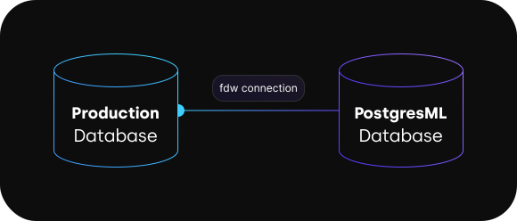

# Foreign Data Wrappers

Foreign data wrappers are a set of Postgres extensions that allow making direct connections to other databases from inside your PostgresML database. Other databases can be your production Postgres database on RDS or Azure, or another database engine like MySQL, Snowflake, or even an S3 bucket.

<figure class="my-3 py-3"><figcaption></figcaption></figure>

## Getting started

A foreign data wrapper connection from PostgresML to another Postgres database requires very little configuration. If your database is accessible from the Internet (like Neon, Supabase, and some AWS RDS & Azure Postgres configurations), you can just grab your connection details from your cloud provider dashboard and create a connection in your PostgresML database with a few SQL commands.

### Create a FDW connection

An FDW connection consists of two configuration components: the _server_ which will define where your production database is located and a _user mapping_ which will define which user & password the connection should use to authenticate to your Postgres database.

FDWs don't require any special configuration on your production database, so all commands below need to be executed on your PostgresML database, not your production database.

#### Create the server

To create the server configuration, take the command below, replace the values for `host`, `port`, and `dbname` with the hostname, port (typically _5432_), and Postgres database name of your production database, and run it on your PostgresML database:




```postgresql
CREATE SERVER production_db
FOREIGN DATA WRAPPER postgres_fdw
OPTIONS (
  host 'your-production-db.amazonaws.com',
  port '5432'
  dbname 'production_db'
);
```




```
CREATE SERVER
```




Once you have a server, you need to configure authentication for your current user (and any other user you may have created in your PostgresML database).

#### Create a user mapping

To create a user mapping, take the command below, replace the values for `user` and `password` and replace them with your actual production user & password. This user doesn't have to be a superuser, and can only have `SELECT` & `USAGE` permissions on your tables and schema.




```postgresql
CREATE USER MAPPING
FOR CURRENT_USER
SERVER production_db
OPTIONS (
  user 'readonly_user',
  password 'secret_password'
);
```




```
CREATE USER MAPPING
```




### Check connectivity

If everything went well, you should be able to connect to your Postgres database from PostgresML:




```postgresql
SELECT *
FROM dblink(
  'production_db',
  'SELECT 1 AS one'
) AS t1(one INTEGER);
```




```
 one 
-----
   1
(1 row)
```




_dblink_ is another extension that can execute arbitrary queries on databases connected with foreign data wrappers. It's great if you want to fetch some data on demand, but it does require you to write your query & table schema every time, which can be a little tedious.

Thankfully, this problem has been already solved with another feature of FDWs which removes the need to specify your schema with every query: _foreign tables_.

### Add your tables

Foreign tables are table schemas that tell your database that the data is actually located in another database. For each query that touches those tables, the FDW extension will take care of fetching the data from your production database in the most efficient way possible, and combine it with data from your PostgresML tables.

There are two ways to specify foreign tables: create them one by one with `CREATE FOREIGN TABLE` command or by importing all of them using `IMPORT FOREIGN SCHEMA` command. Unless you have some special user permissions that don't allow the user we've configured in the _user mapping_ above to access all your tables, we recommend you use the second option to import all your tables.

#### Import tables

Table import requires two steps: create a schema to host the tables, and import the tables from your database using the FDW connection:




```postgresql
CREATE SCHEMA production_tables;

IMPORT FOREIGN SCHEMA public
FROM SERVER production_db
INTO production_tables;
```




```
CREATE SCHEMA
IMPORT FOREIGN SCHEMA
```




If everything went well, your tables should appear in the `production_tables` schema. You can now use them in normal queries without worrying about data types or column names.

### Accelerate bulk access

Foreign data wrappers make connections to your database as needed to fetch data. This can add latency when fetching a lot of data at once. If you need to run some kind of batch job, for example to generate embeddings using `pgml.embed()`, it's best to first copy your table data over into your PostgresML database. Using an example of a `users` table, FDWs make that as easy as:




```postgresql
CREATE TABLE bulk_access_users (
  LIKE production_tables.users
);

INSERT INTO bulk_access_users 
SELECT * FROM production_tables.users;
```




```
CREATE TABLE
INSERT 0 1000
```




You can now add an embedding column to `bulk_access_users` and generate embeddings for your users using just one query:




```postgresql
ALTER TABLE bulk_access_users
ADD COLUMN embedding vector(384);

UPDATE bulk_access_users
SET embedding = pgml.embed('Alibaba-NLP/gte-base-en-v1.5', email);
```




```
ALTER TABLE
UPDATE 1000
```




Once embedding generation is complete, you can copy the vectors back into your production database using similar SQL commands, just in reverse.

If you want to use embeddings as part of a real time application, e.g. semantic search, you should add the PostgresML database into your application and connect to it directly instead.
