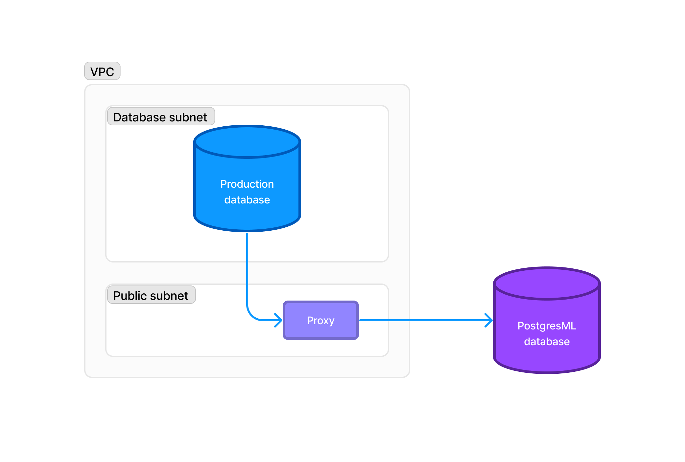

# Connect your VPC to PostgresML

If your database doesn't have Internet access, PostgresML will need a service to proxy connections to your database. Any TCP proxy will do,
and we also provide an nginx-based Docker image than can be used without any additional configuration.

<figure><figcaption></figcaption></figure>

## PostgresML IPs by region

| Region                  | List of IP addresses |
|-------------------------|----------------|
| AWS US West 2           | 100.20.31.186, 44.228.201.73,  44.238.193.82 |
