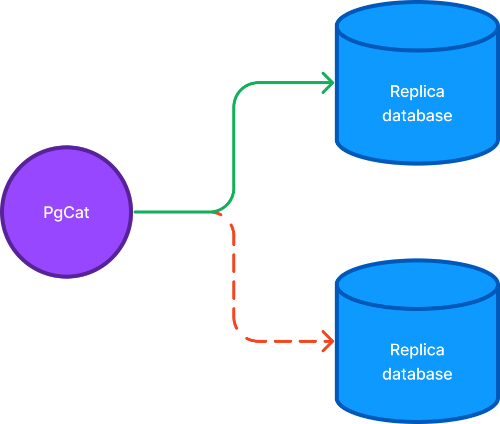
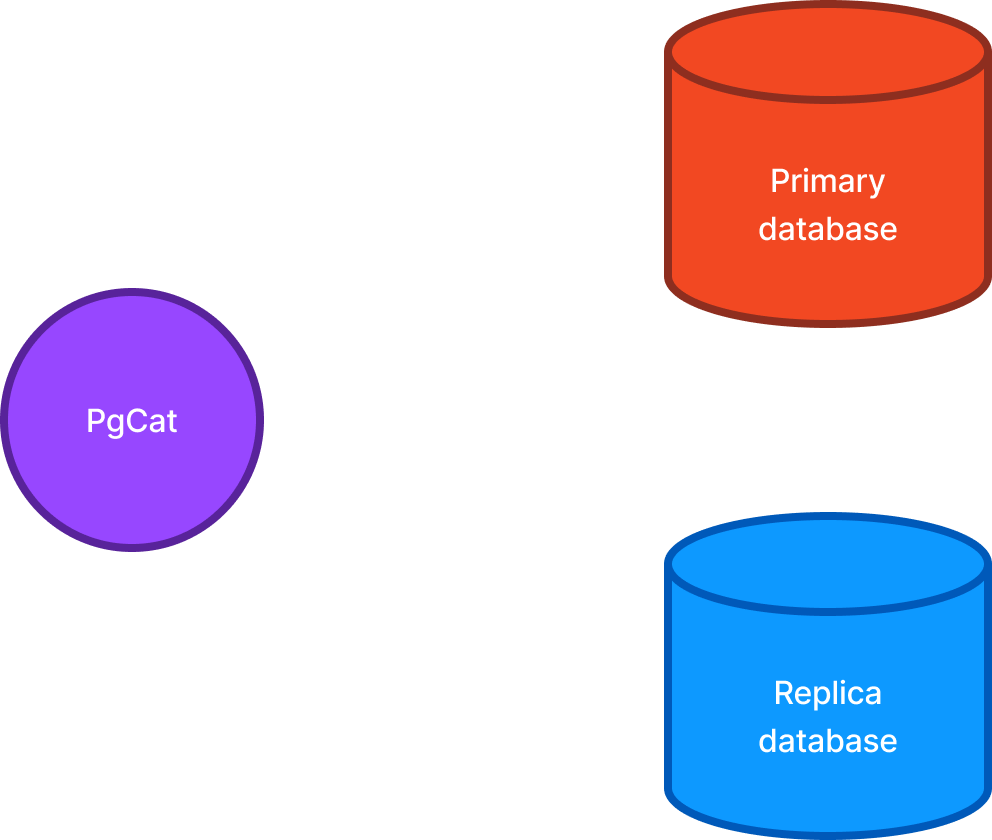

# PgCat features

PgCat has many features currently in various stages of readiness and development. Most of its features are used in production and at scale.

### Query load balancing 

	

		<figure class="my-4">
			
		</figure>
	

	

		
PgCat can automatically load balance Postgres queries between multiple replicas. Clients connect to a single PgCat instance, which pretends to be a Postgres database, while the pooler manages its own connections to the replicas.

		
The queries are evenly distributed to all available servers using one of the three supported load balancing strategies: random, round robin, or least active connections.

		
Random load balancing picks a replica using a random number generator. Round robin counts queries and sends them to replicas in order. Least active connections picks the replica with the least number of actively running queries.

	

Which load balancing strategy to choose depends on the workload and the number of replicas. Random, on average, is the most fair strategy, and we recommended it for most workloads.

Round robin assumes all queries have equal cost and all replicas have equal capacity to service requests. If that's the case, round robin can improve workload distribution over random query distribution.

Least active connections assumes queries have different costs and replicas have different capacity, and could improve performance over round robin, by evenly spreading the load across replicas of different sizes.

### High availability

	

		<figure class="my-4">
			
		</figure>
	

	

		
Just like any other modern load balancer, PgCat supports health checks and failover. It maintains an internal map of healthy and unavailable replicas, and makes sure queries are only routed to healthy instances.

		
If a replica fails a health check, it is banned from serving additional traffic for a configurable amount of time. This significantly reduces errors in production when instance hardware inevitably fails.

		
Broken replicas are checked again after the traffic ban expires, and if they continue to fail, are prevented from serving queries. If a replica is permanently down, it's best to remove it from the configuration to avoid any intermittent errors.

	

High availability is important for production deployments because database errors are typically not recoverable. The only way to have a working application is to have a running database; placing PgCat in front of multiple machines increases the overall availability of the system.

### Read/write query separation

	

		<figure class="my-4">
			
		</figure>
	

	

		
A typical application reads data much more frequently than writes it. To help scale read workloads, PostgreSQL deployments add read replicas which can serve <code>SELECT</code> queries.

		
PgCat is able to inspect queries and determine if the query is a <code>SELECT</code> which, most of the time, will read data, or a write query like an <code>INSERT</code> or <code>UPDATE</code>.

		
If PgCat is configured with both the primary and replicas, it will route all read queries to the replicas, while making sure write queries are sent to the primary.

	

Removing read traffic from the primary can help scale it beyond its normal capacity, and can also help with high availability, as the primary is typically the most loaded instance in a deployment. No application modifications are required to take advantage of this functionality, so ORMs like Rails, Django and others don't need any special configuration or query annotations.

### Sharding

	

		<figure class="my-4">
			
		</figure>
	

	

		
Sharding allows to horizontally scale database workloads of all kinds, including writes. The data is evenly split into pieces and each piece is placed onto a different server. The query traffic is then equally split between the shards, as the application usage increases over time.

		
Since PgCat inspects every query, it's able to extract the sharding key (typically a table column) from the query and route the query to the right shard.

		
Both read and write queries are supported, as long as the sharding key is specified. If that's not the case, PgCat will execute queries against all shards in parallel, combine the results, and return all of them as part of the same request.

	

While multi-shard queries are generally not recommended to scale typical workloads, they can be very useful in scatter-gather algorithms, like vector similarity search and ranking. Having the ability to talk to multiple servers simultaneously can scale database performance linearly with the size of the data.

If the sharding key is not readily available, query metadata can be added to instruct PgCat to route the query to a specific shard. This requires the client to add annotations manually, which isn't scalable but can be a good workaround when no other option is available.

### Multithreading

PgCat is written in Rust using Tokio, which allows it to use all the CPU cores if more than one is available. This simplifies deployments in environments with large transactional workloads, by requiring only one instance of PgCat per machine.

This architecture allows to offload more work to the pooler which otherwise would have to be implemented in the clients, without blocking access the database. For example, if we wanted to perform some CPU-intensive workload for some queries, we are able to do so for multiple client queries, concurrently.

### Additional standard features

In addition to novel features that PgCat introduces to Postgres deployments, it supports all the standard features expected from a pooler:

* Authentication, multiple users and databases
* TLS encryption
* Zero downtime configuration changes
* Statistics and an admin database for monitoring and management
* Transaction and session query mode

and many more. For a full list, take a look at our [GitHub repository](https://github.com/postgresml/pgcat).

