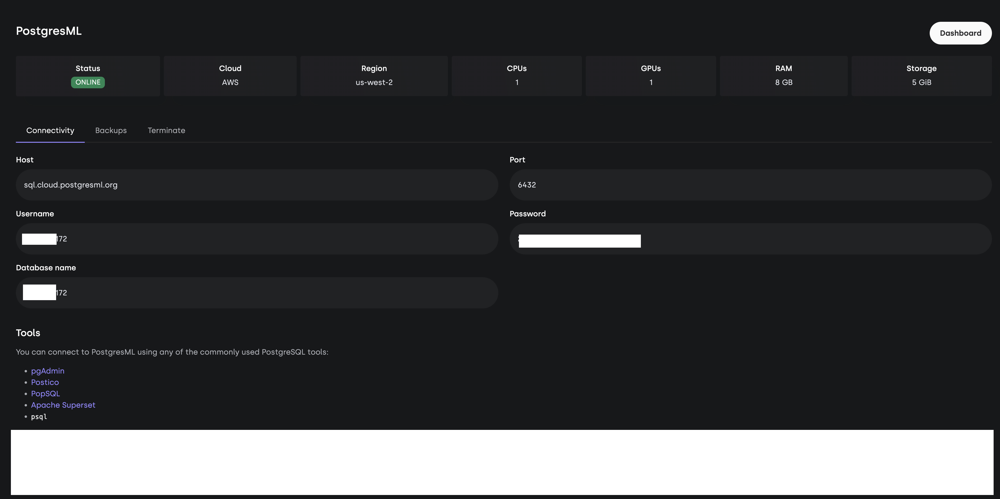
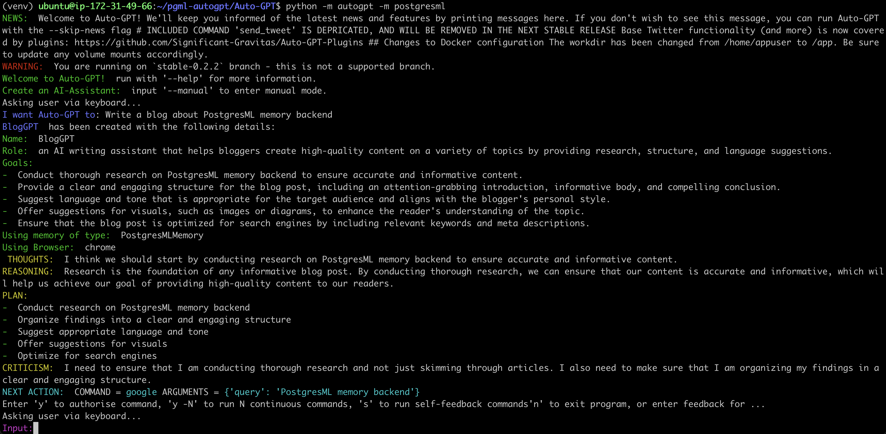

## PostgresML as a memory backend to AutoGPT

AutoGPT is an open-source, autonomous AI tool that uses GPT-4 to interact with software and services online. PostgresML is an open-source library that allows you to add machine learning capabilities to your PostgreSQL database.

In this blog post, I will show you how to add PostgresML as a memory backend to AutoGPT. This will allow you to use the power of PostgresML to improve the performance and scalability of AutoGPT.

### What is AutoGPT?

AutoGPT is an open-source, autonomous AI tool that uses GPT-4 to interact with software and services online. It was developed by Toran Bruce Richards and released on March 30, 2023.

AutoGPT can perform a variety of tasks, including:

- Debugging code
- Writing emails
- Conducting market research
- Developing software applications
- Helping businesses improve their processes

Auto-GPT is still under development, but it has the potential to be a powerful tool for a variety of tasks. It is still early days, but Auto-GPT is already being used by some businesses and individuals to improve their productivity and efficiency.

### What is PostgresML?

PostgresML is a machine learning extension to PostgreSQL that enables you to perform training and inference on text and tabular data using SQL queries. With PostgresML, you can seamlessly integrate machine learning models into your PostgreSQL database and harness the power of cutting-edge algorithms to process data efficiently.

PostgresML supports a variety of machine learning algorithms, including:

- Regression
- Classification
- Natural language processing
- Sentence Embeddings

PostgresML is a powerful tool that can be used to build AI powered applications on your database.

### Why add PostgresML as a memory backend to AutoGPT?
Developing AI-powered applications requires a range of APIs for carrying out different tasks such as text generation, sentence embeddings, classification, regression, ranking etc, as well as a stateful database to store all of the features. However, the current trend of stateless REST APIs puts a burden on AI application developers, requiring them to assemble a web of services, pub/sub systems, algorithms, models and specialized datastores, rather than focusing on the application itself and providing a delightful experience to their users.

PostgresML brings AI tasks to the database to reduce the infrastructure complexity that app developers have to handle. This means that app developers can prototype and deploy AI applications quickly and at scale, in a matter of minutes, that would otherwise have taken weeks to develop. By streamlining the infrastructure requirements, PostgresML allows developers to concentrate on creating intelligent and engaging applications, making it a valuable tool for anyone looking to develop AI-powered applications with ease.


### Register the memory backend module with AutoGPT

Adding PostgresML as a memory backend to AutoGPT is a relatively simple process. The steps involved are:

1. Download and install Auto-GPT.
    ```shell
    git clone https://github.com/postgresml/Auto-GPT
    cd Auto-GPT
    git checkout stable-0.2.2
    python3 -m venv venv
    source venv/bin/activate
    pip install -r requirements.txt
    ```

2. Start PostgresML using [Docker](https://github.com/postgresml/postgresml#docker) or [sign up for a free PostgresML account](https://postgresml.org/signup). 

3. Install `postgresql` command line utility
    - Ubuntu: `sudo apt install libpq-dev`
    - Centos/Fedora/Cygwin/Babun.: `sudo yum install libpq-devel`
    - Mac: `brew install postgresql`

4. Install `psycopg2` in 

    - `pip install psycopg2`

5. Setting up environment variables

    In your `.env` file set the following if you are using Docker:

    ```shell
    POSTGRESML_HOST=localhost
    POSTGRESML_PORT=5443
    POSTGRESML_USERNAME=postgres
    POSTGRESML_PASSWORD=""
    POSTGRESML_DATABASE=pgml_development
    POSTGRESML_TABLENAME =autogpt_text_embeddings
    ```

    If you are using PostgresML cloud, use the hostname and credentials from the cloud platform.
    

### Start Auto-GPT with PostgresML memory backend
Once the `.env` file has all the relevant PostgresML settings you can start autogpt that uses PostgresML backend using the following command:

```shell
python -m autogpt -m postgresml
```

You will see AutoGPT in action with PostgresML backend as shown below. You should see *Using memory of type: PostgresMLMemory* in the logs.



### Conclusion
In this blog post, I showed you how to add PostgresML as a memory backend to AutoGPT. Adding PostgresML as a memory backend can significantly accelerate performance and scalability of AutoGPT. It can enable you to rapidly prototype with AutoGPT and build AI-powered applications.

I hope this blog post was helpful. If you have any questions, please leave a comment below.