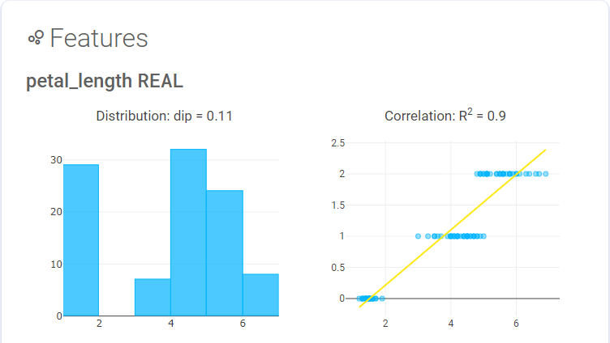

<style>
:root {
  --shadow-2: rgba(0,0,0,0.25);
}

.md-typeset h1 {
  font-size: 3em;
  font-weight: 700;
  margin-bottom: -1rem;
  max-width: 80em; 
}

.md-typeset p.subtitle {
  font-weight: 100;
  margin: 2em;
  max-width: 80em; 
}

.md-typeset img {
  margin: 0;
  border-radius: 10px;
}

.md-grid {
  max-width: 100em; 
}

video, img {
  max-width: 90%;
  margin: 2em 5%;
}

.grid {
  display: flex;
  gap: 5%;
  flex-direction: row;
  max-width: 100%;
  flex-wrap: wrap;
}

.grid .card img {
    box-shadow: 0 1px 2px var(--shadow-2);
}
.grid .card {
  width: 47%;
  padding: 1em 2em;
  border-radius: 10px;
  box-shadow: 0 1px 2px var(--shadow-2);
  overflow: auto;
  margin-bottom: 2em;
  transition: transform .2s;
}
.grid .card:hover {
  transform: scale(1.025);
  box-shadow: 1px 2px 4px var(--shadow-2);
}
.bare .card {
  padding: 0;
  border-radius: 0px;
  box-shadow: initial;
}
.bare .card:hover {
  box-shadow: initial;
}
@media only screen and (max-width: 690px) {
  .grid .card { width: 100%; }
  .bare .card:nth-child(3) { order: 4; }
  .bare .card:nth-child(4) { order: 3; }
}
</style>

<h1 align="center">End-to-end<br/>machine learning solution</h1>

<p align="center" class="subtitle">
    Train and deploy models to make online predictions using only SQL, with an open source extension for Postgres. Manage your projects and visualize datasets using the built in dashboard.
</p>

<p align="center" markdown>
  [Demo](https://demo.postgresml.org/){ .md-button .md-button--primary }
  [:material-github:](https://github.com/postgresml/postgresml/){ .md-button }
</p>

<video autoplay loop muted>
  <source src="images/demo.webm" type="video/webm">
  
</video>

## Pure SQL Solution

<div class="grid bare" markdown>
  <div class="card" markdown>
```sql linenums="1" title="train.sql"
SELECT pgml.train(
  'My project name', 
  objective => 'regression',
  relation_name => 'my_table_with_data',
  y_column_name => 'my_column_with_labels',
  algorithm => 'xgboost' 
);
```
  </div>


  <div class="card" markdown>

  </div>

  <div class="card" markdown>

  </div>

  <div class="card" markdown>
```sql linenums="1" title="deploy.sql"
SELECT pgml.deploy(
  'My project name', 
  strategy => 'most_recent',
  algorithm => 'xgboost'
);
```
  </div>

  <div class="card" markdown>
```sql linenums="1" title="predict.sql"
SELECT *, pgml.predict(
  'My project name', 
  ARRAY[...] -- same features used in training
  ) as prediction
FROM my_new_unlabeled_table
ORDER BY prediction DESC;
```
  </div>

  <div class="card" markdown>

  </div>
</div>

<p align="center" markdown>
  [Get Started](guides/installation/){ .md-button .md-button--primary }
</p>
## What's in the box

<div class="grid" markdown>
  <div class="card" markdown>
:material-lightbulb-group:
__All your favorite algorithms__

Whether you need a simple linear regression, or extreme gradient boosting, we've included support for all classification and regression algorithms in [Scikit Learn](https://scikit-learn.org/) and [XGBoost](https://xgboost.readthedocs.io/) with no extra configuration.
  </div>
  <div class="card" markdown>
:material-clipboard-check:
__Managed model deployements__

Models can be periodically retrained and automatically promoted to production depending on their key metric. Rollback capability is provided to ensure that you're always able to serve the highest quality predictions, along with historical logs of all deployments for long term study.
  </div>
  <div class="card" markdown>
:material-cloud-outline:
__Online and offline support__

Predictions are served via a standard Postgres connection to ensure that your core apps can always access both your data and your models in real time. Pure SQL workflows also enable batch predictions to cache results in native Postgres tables for lookup.
  </div>
  <div class="card" markdown>
:fontawesome-solid-arrow-trend-up:
__Instant visualizations__

Run standard analysis on your datasets to detect outliers, bimodal distributions, feature correlation, and other common data visualizations on your datasets. Everything is cataloged in the dashboard for easy reference.
  </div>
  <div class="card" markdown>
:material-graph-outline:
__Hyperparameter search__

Use either grid or random searches with cross validation on your training set to discover the most important knobs to tweak on your favorite algorithm.
  </div>
  <div class="card" markdown>
:material-arrow-top-right-thin:
__SQL native vector operations__

Vector operations make working with learned emebeddings a snap, for things like nearest neighbor searches or other similarity comparisons.
  </div>
  <div class="card" markdown>
:fontawesome-solid-link:
__The performance of Postgres__

Since your data never leaves the database, you retain the speed, reliability and security you expect in your foundational stateful services. Leverage your existing infrastructure and expertise to deliver new capabilities.
  </div>
  <div class="card" markdown>
:fontawesome-solid-envelope-open-text:
__Open source__

We're building on the shoulders of giants. These machine learning libraries and Postgres have recieved extensive academic and industry use, and we'll continue their tradition to build with the community. Licensed under MIT.
  </div>
</div>
